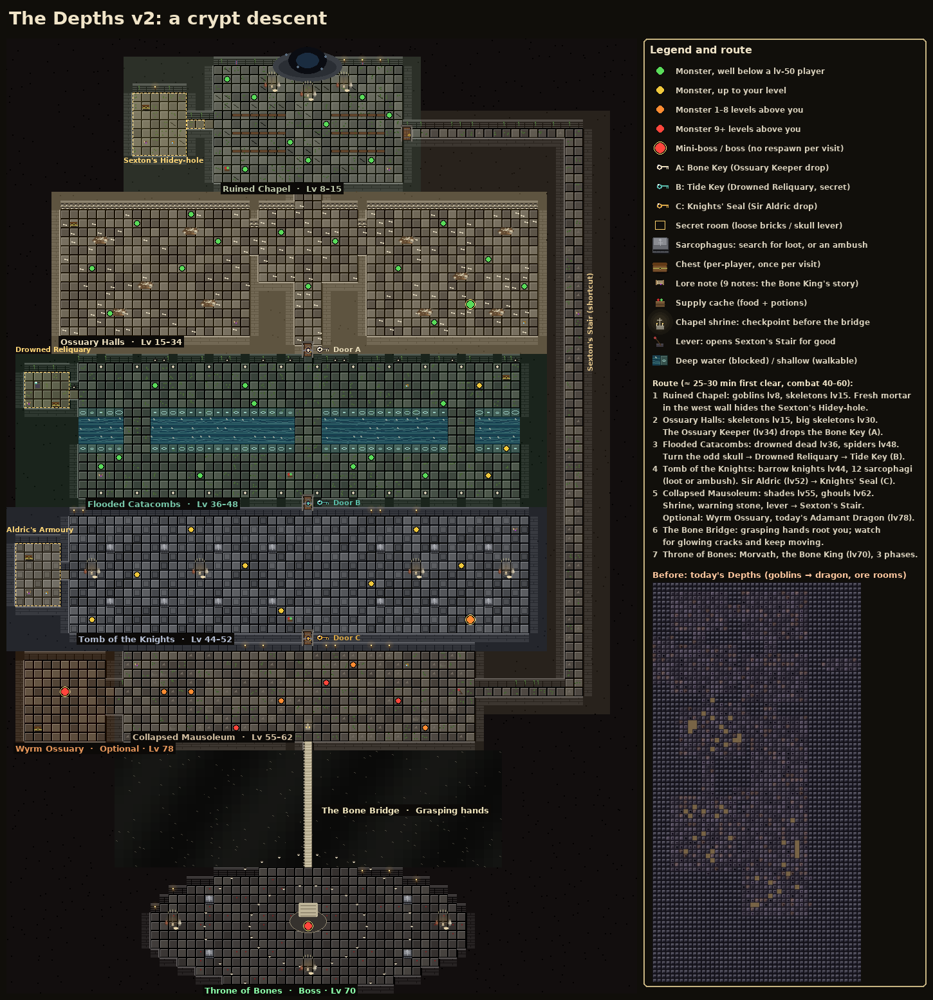
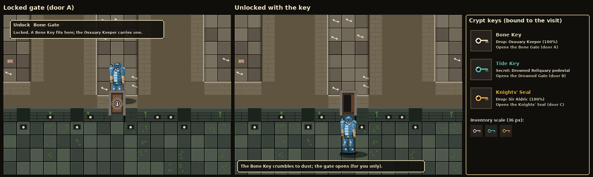
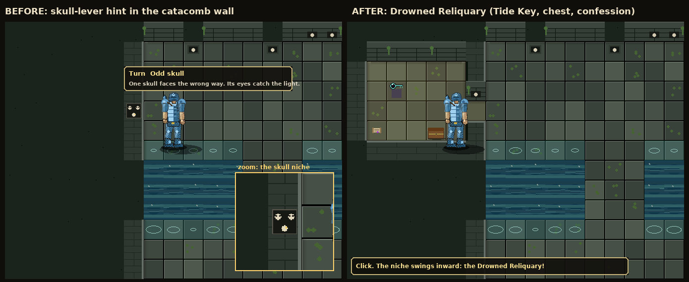
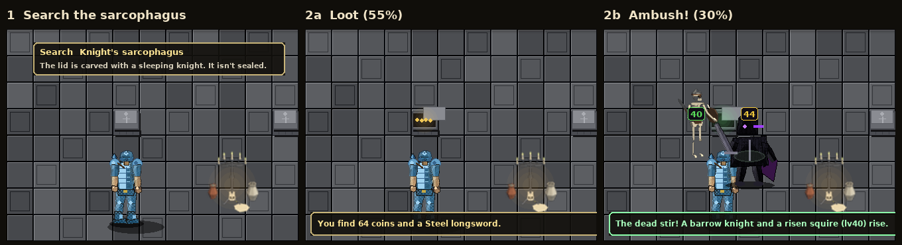
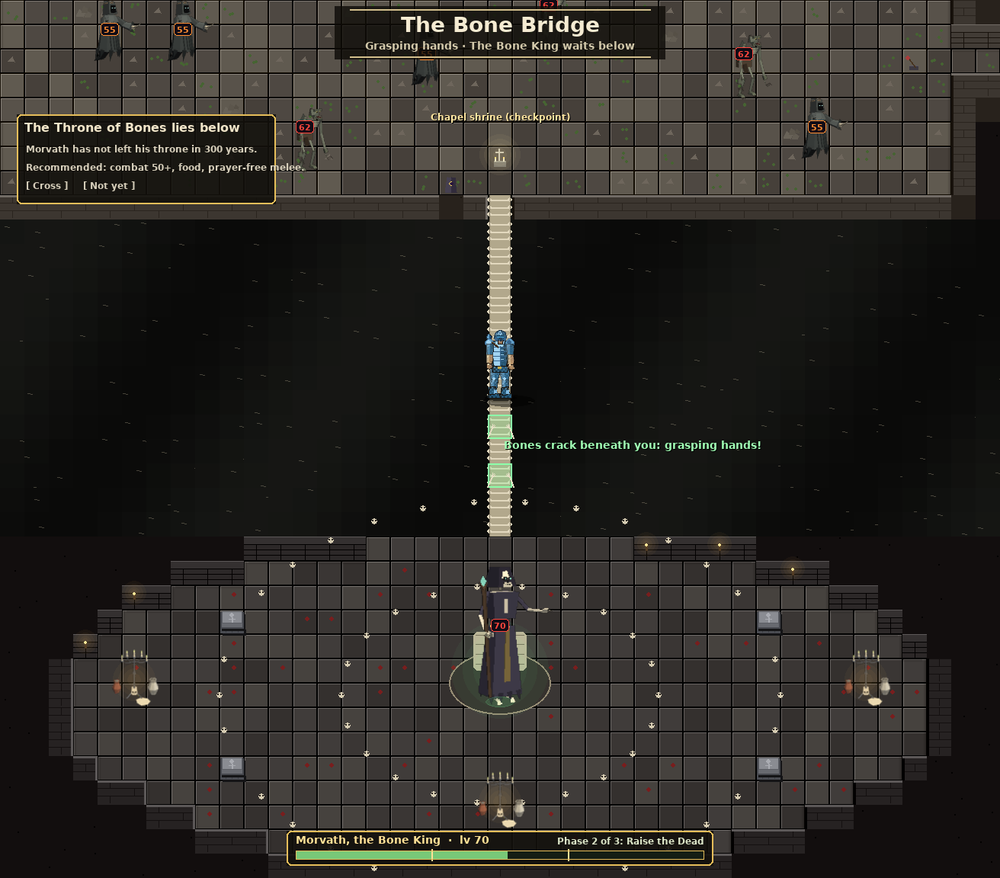
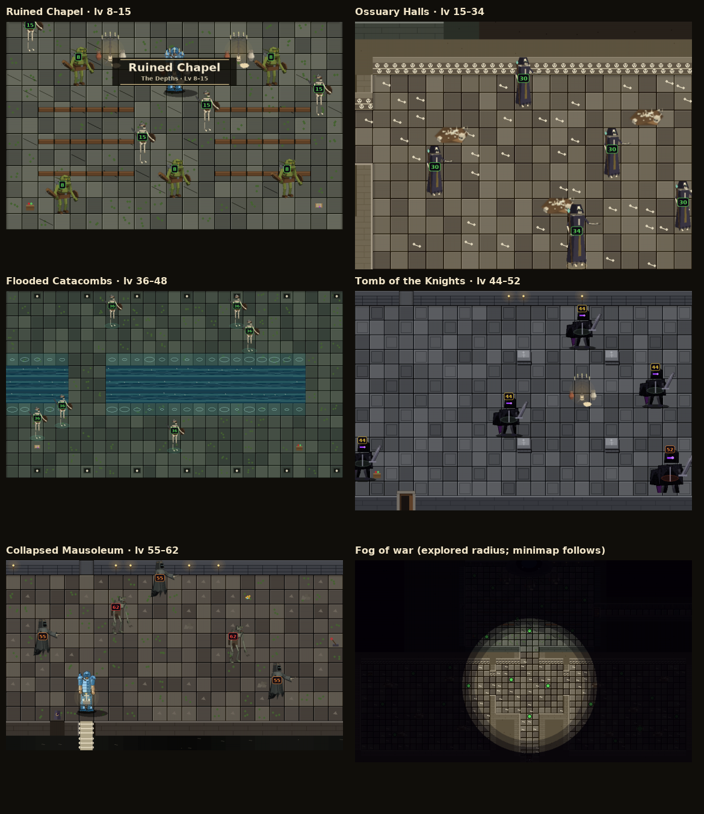

# The Depths v2: a crypt descent (design)

The Depths today is a mine/cave mix of goblins, skeletons, giants, spiders and one Adamant Dragon (see `DEPTHS_CODE_REVIEW.md`). v2 turns it into a **crypt descent**:
- it starts in a ruined chapel and goes down through bone-walled ossuaries, flooded catacombs and a knights' tomb to a collapsed mausoleum;
- a 1-tile **Bone Bridge** crosses a bottomless burial pit;
- **Morvath, the Bone King** waits on the other side.

**Source of truth:** `reference_code/depths_map.py` (grid 70×106, plus spawns, doors, keys, secrets, chests, lore) and the exported `depths_map.json`.
**Renders:** `tools/depths_render.py` and `tools/depths_concepts.py`, adapted from the void pack's renderer.

It's built on the **same systems** as the Void Sanctum v2: doors/keys, secrets, chests, fog, banners, the boss bar and in-instance respawn. The Depths either reuses them or builds them generically (see `CURSOR_PROMPT.md`).

## 1. Zones and route

| # | Zone | Levels | Feel | Gate out |
|---|---|---|---|---|
| 1 | Ruined Chapel | 8–15 | broken pews, stained glass, candelabra, moss | open stair down |
| 2 | Ossuary Halls | 15–34 | walls of stacked skulls, bone piles, three halls | **Door A: Bone Gate** (Bone Key, from the Ossuary Keeper) |
| 3 | Flooded Catacombs | 36–48 | burial niches, a green-black deep channel with 3 shallow fords | **Door B: Drowned Gate** (Tide Key, secret reliquary) |
| 4 | Tomb of the Knights | 44–52 | 12 knight sarcophagi, candelabra, a dais | **Door C: Knights' Seal** (Sir Aldric) |
| 5 | Collapsed Mausoleum | 55–62 | rubble, cracked columns, the shrine, a warning stone, the shortcut lever | Bone Bridge |
| 5b | Wyrm Ossuary (optional) | 78 | today's Adamant Dragon on a hoard of bones | dead end |
| 6 | The Bone Bridge | hazard | 1 wide and 13 long over a bottomless burial pit | arena |
| 7 | Throne of Bones | boss 70 | a round arena, a ring of skulls, 4 sarcophagi, a bone throne | exit on kill |
| – | Sexton's Stair | shortcut | a long service corridor from the mausoleum to the chapel | the gate X opens once the lever is pulled |

**First clear:** about 25–30 minutes at combat 40–60. **Re-runs** with the shortcut: about 12 minutes.
**Levels climb with depth:** 8 → 15 → 30 → 34 (mini-boss) → 36 → 44/48 → 52 (mini-boss) → 55/62 → 70 (boss). The optional dragon (78) stays the hardest thing in the dungeon.



## 2. Tile map
Legend (the void legend plus the crypt tiles):
- `#` wall, `.` floor, `E` exit, `P` spawn
- `A B C` locked doors
- `S` loose-brick secret wall, `K` skull-lever secret niche
- `h` hidden floor (sent as wall until revealed)
- `c` chest, `$` supply cache, `l` lore note, `i` clutter (pews, bone piles, niches, rubble)
- `Z` sarcophagus (blocked, searchable)
- `%` shallow water (walkable), `W` deep water (blocked)
- `~` burial pit (blocked), `=` bridge
- `H` shrine, `w` warning stone, `v` lever, `X` shortcut gate
- `o` candelabrum, `b` boss throne, `g` ground loot

```
######################################################################
######################################################################
#################################E####################################
#######################.....................##########################
#######################..........P..........##########################
#######################......o.......o......##########################
##############hhhhhh###..........o..........##########################
##############hchhhh###.....................##########################
##############hhhhhh###..iiiiii.....iiiiii..##########################
##############hhhhhhhhS.....................##########################
##############hhhhhh###..iiiiii.....iiiiii..X...................######
##############hlhh$h###.....................##################..######
##############hhhhhh###..iiiiii.....iiiiii..##################..######
#######################.....................##################..######
#######################.g.................l.##################..######
#######################.....................##################..######
################################...###########################..######
################################...###########################..######
################################...###########################..######
######.....................#...........#...................###..######
######.c...................#...........#...................###..######
######..............i..................................i...###..######
######....i.................................i..............###..######
######.....................................................###..######
######.....................#...........#...................###..######
######.....................#...........#...................###..######
######.....................#...........#..........i........###..######
######.........i...........#####...#####...................###..######
######.....................#####...#####...................###..######
######................i....#####...#####...................###..######
######......i..............#####...#####......i.......i....###.l######
######...................l.#####...#####.................$.###..######
######.....................#####...#####...................###..######
################################...###########################..######
#################################A############################..######
#################################.############################..######
########..i...i...i...i...i...i...i...i...i...i...i...i..#####..######
##hhhhh#...............................................c.#####..######
##hkhhh#....................................$............#####..######
##hhhhhK.................................................#####..######
##lhhch#.................................................#####..######
########%%%%%...%%%%%%%%%%%%%%%%...%%%%%%%%%%%%%%...%%%%%#####..######
########WWWWW...WWWWWWWWWWWWWWWW...WWWWWWWWWWWWWW...WWWWW#####..######
########WWWWW...WWWWWWWWWWWWWWWW...WWWWWWWWWWWWWW...WWWWW#####..######
########WWWWW...WWWWWWWWWWWWWWWW...WWWWWWWWWWWWWW...WWWWW#####..######
########%%%%%...%%%%%%%%%%%%%%%%...%%%%%%%%%%%%%%...%%%%%#####..######
########.................................................#####..######
########.................................................#####..######
########..l....................g.........................#####..######
########.................................................#####..######
########..i...i...i...i...i...i...i...i...i...i...i...i..#####..######
#################################B############################..######
#################################.############################..######
#######...................................................####..######
#######.................................................l.####..######
#######...................................................####..######
#hhhhh#....Z.....Z.....Z.....Z...........Z.....Z.....Z....####..######
#hchhh#...................................................####..######
#hhhhh#...................................................####..######
#hhhhhS..o...........o.......................o.........o..####..######
#hhhhh#...................................................####..######
#hlh$h#...................................................####..######
#hhhhh#....Z.....Z.....Z.....Z...........Z.....Z.....Z....####..######
#######...................................................####..######
#######........................g..........................####..######
#######...................................................####..######
#################################C############################..######
#################################.############################..######
#############.......................................##########..######
##.........##.l.............................$...i...##########..######
##.........##...ii.........i........................##########..######
##.........##...........................i...........##########..######
##................................................v.............######
##..................................................##################
##....................i.............................##################
##.........##................................ii.....##################
##.c.......##.....i..............H..................##################
##.........##..................w....................##################
#################################=####################################
############~~~~~~~~~~~~~~~~~~~~~=~~~~~~~~~~~~~~~~~~~~~###############
############~~~~~~~~~~~~~~~~~~~~~=~~~~~~~~~~~~~~~~~~~~~###############
############~~~~~~~~~~~~~~~~~~~~~=~~~~~~~~~~~~~~~~~~~~~###############
############~~~~~~~~~~~~~~~~~~~~~=~~~~~~~~~~~~~~~~~~~~~###############
############~~~~~~~~~~~~~~~~~~~~~=~~~~~~~~~~~~~~~~~~~~~###############
############~~~~~~~~~~~~~~~~~~~~~=~~~~~~~~~~~~~~~~~~~~~###############
############~~~~~~~~~~~~~~~~~~~~~=~~~~~~~~~~~~~~~~~~~~~###############
############~~~~~~~~~~~~~~~~~~~~~=~~~~~~~~~~~~~~~~~~~~~###############
############~~~~~~~~~~~~~~~~~~~~~=~~~~~~~~~~~~~~~~~~~~~###############
############~~~~~~~~~~~~~~~~~~~~~=~~~~~~~~~~~~~~~~~~~~~###############
############~~~~~~~~~~~~~~~~~~~~~=~~~~~~~~~~~~~~~~~~~~~###############
############~~~~~~~~~~~~~~~~~~~~~=~~~~~~~~~~~~~~~~~~~~~###############
############~~~~~~~~~~~~~~~~~~~~~=~~~~~~~~~~~~~~~~~~~~~###############
############################...........###############################
#######################.....................##########################
####################...........................#######################
##################....Z.....................Z....#####################
#################.................................####################
################...................................###################
################..o..............b..............o..###################
################...................................###################
################...................................###################
#################.....Z.....................Z.....####################
###################.............................######################
#####################............o............########################
########################...................###########################
######################################################################
```

## 3. Monsters
Existing undead and cave types are reused. The new types are thin `MONSTERS` entries with a `visual` key pointing at an existing drawer, plus a tint and scale.

| Zone | Monster | Visual (existing) | Lv | Count | Respawn in-instance | Drops (highlights) |
|---|---|---|---|---|---|---|
| Chapel | goblin | goblin | 8 | 5 | yes, 25 ticks×1.5 | as today |
| Chapel | skeleton | skeleton | 15 | 4 | yes | bones, as today |
| Ossuary | skeleton | skeleton | 15 | 8 | yes | as today |
| Ossuary | big_skeleton | big_skeleton | 30 | 6 | yes | big bones, as today |
| Ossuary | **Ossuary Keeper** `ossuary_keeper` | big_skeleton ×1.35, bone tint | 34 | 1 | **no** | **Bone Key (100%)**, big bones, 150–300 coins |
| Catacombs | **Drowned Dead** `drowned_dead` | skeleton, green-water tint | 36 | 10 | yes | bones, seaweed, iron/steel gear, coins |
| Catacombs | spider | spider | 48 | 3 | yes | as today |
| Tomb | **Barrow Knight** `barrow_knight` | shadow_knight, steel-grey tint | 44 | 8 (+ ambushes) | yes | steel/mithril gear, coins, big bones |
| Tomb | **Sir Aldric the Unquiet** `sir_aldric` | shadow_knight ×1.3, gold trim | 52 | 1 | **no** | **Knights' Seal (100%)**, mithril sword/shield, 400–700 coins |
| Mausoleum | shade | shade | 55 | 5 | yes | as today |
| Mausoleum | crypt_ghoul | crypt_ghoul | 62 | 3 | yes | as today |
| Wyrm Ossuary | dragon (Adamant Dragon) | dragon | 78 | 1 | **no** (per visit) | **as today, including Mythos** |
| Arena | **Morvath, the Bone King** `morvath` | big_skeleton ×2, gold bone crown, green aura | 70 | 1 | **no** | see §7 |

That's **56 placed monsters**, against 44 inside today's region, plus about 3–4 sarcophagus ambushes (2 each) and the boss's phase-2 adds, so roughly **65–70 fights a run**.

**Suggested stats for the new types.** These follow the curve of the existing neighbours (skeleton 15/26hp, big_skeleton 30/52, spider 48/95, shade 55/110, crypt_ghoul 62/135).

| Type | Lv | HP | Att | Str | Def | Aggro | Respawn | XP | Notes |
|---|---|---|---|---|---|---|---|---|---|
| ossuary_keeper | 34 | 90 | 24 | 26 | 20 | 5 | – | 220 | every 10 ticks: bone toss at a telegraphed tile |
| drowned_dead | 36 | 68 | 26 | 28 | 20 | 6 | 45 | 140 | rises from the shallows when you come near |
| barrow_knight | 44 | 88 | 34 | 36 | 32 | 6 | 50 | 190 | also used for ambushes |
| sir_aldric | 52 | 180 | 42 | 44 | 40 | 8 | – | 520 | shield bash (2-tile telegraph); calls 2 barrow knights at 50% HP, once |
| morvath | 70 | 420 | 62 | 66 | 55 | 12 | – | 1800 | `confine_room` = arena; phases in §7 |

AI (shared with the Void v2):
- use `aggro_range`;
- `home_room` = zone rect;
- respawn in the instance after `respawn_ticks×1.5`, only when the player is more than 8 tiles away;
- `NO_RESPAWN` = keeper, Aldric, dragon, Morvath.

## 4. Doors and keys
All three keys are `type: "key"` items, bound to the dungeon: not tradeable, not droppable, not bankable, and stripped on leave, login and death. A door consumes its key.

| Door | Tile | Key | Where the key comes from |
|---|---|---|---|
| A: Bone Gate | (33,34) | `depths_bone_key` | drop from the Ossuary Keeper (lv34), east hall (51,29) |
| B: Drowned Gate | (33,51) | `depths_tide_key` | pedestal (3,38) inside the **Drowned Reliquary**, which only the skull-lever secret opens |
| C: Knights' Seal | (33,66) | `depths_knight_seal` | drop from Sir Aldric (lv52), tomb dais (51,64) |

Hover texts:
- "Unlock Bone Gate: Locked. A Bone Key fits here; the Ossuary Keeper carries one."
- The other two follow the same pattern.



## 5. Secrets (3)

| Secret | Wall | Kind | Hint (visual + hover) | Reward |
|---|---|---|---|---|
| Sexton's Hidey-hole | (22,9) chapel west wall | loose bricks | a patch of fresh pale mortar; "The mortar here is fresh, and the bricks shift under your hand." | chest (early gear and food), Sexton's Diary |
| Drowned Reliquary | (7,39) catacomb west wall | **skull lever** | one skull in the niche faces the wrong way, with glinting eyes | **Tide Key** pedestal, chest, Brother's Confession (the lore note tells you which skull to turn) |
| Aldric's Armoury | (6,59) tomb west wall | loose bricks | candle flames lean toward the wall (a draught) | chest (mithril tier), supply cache, Armourer's Tally |

Hidden rooms are sent to the client as wall until revealed, so they don't leak onto the minimap. They're hidden again on the next visit.



## 6. Sarcophagi, items and lore
**Sarcophagi** (12 in the tomb, 4 in the arena that can't be searched):
- "Search Knight's sarcophagus" takes 2 ticks.
- Roll once per visit per sarcophagus: **loot 55%** (coins 40–120, a steel or mithril item, sometimes a gem) / **ambush 30%** (barrow knight lv44 + risen squire, a skeleton visual at lv40) / **empty 15%**.
- An ambush always spawns 1 tile away, with a 1-tick "The dead stir!" warning.



**Other items:**
- **Chests (6):** ossuary, catacomb, hidey-hole, reliquary, armoury, wyrm hoard. Each pays once per visit per player, straight into the inventory, then shows the open frame.
- **Supply caches (3):** chapel, before door B and before door C. Food and 1–2 potions, once per visit.
- **Ground loot (5):** bones, coins and an odd rune, placed at build.

**Lore notes (9)**, which tell the crypt's story in order:
1. Chapel Notice: the Brothers of Saint Vell keep the dead below.
2. Sexton's Diary: the Abbot pays to have the old king moved deeper.
3. Bone Wall Inscription: ten thousand faithful; the Keeper counts them.
4. Waterlogged Page: the river broke in; the tide key is sealed behind the skulls.
5. Brother's Confession: "I turned the third skull…" (the hint for the reliquary).
6. Knight's Epitaph: Sir Aldric swore to guard King Morvath past death.
7. Armourer's Tally: blades for an honour guard that doesn't breathe.
8. Cracked Tablet: the Abbot's forbidden rite; the roof fell; the King rose.
9. Sexton's Scratches: the stair to the chapel; "the bar lifts only from below" (the hint for the shortcut).

## 7. The Bone Bridge and the boss
**Checkpoint:** the **chapel shrine** (33,76) in the mausoleum heals 50% once per visit and sets the respawn point for the visit. The **warning stone** (31,77) opens the modal "The Throne of Bones lies below… Recommended: combat 50+ [Cross] [Not yet]".

**Bridge hazard: grasping hands.** This is deliberately different from the void wind: there's no push and no falling.
- Every ~4 s, 2–3 random bridge tiles show **glowing green bone cracks** for a 1.5 s telegraph.
- Then skeletal hands burst up. If you're standing on one of those tiles: **rooted for 2–3 ticks and 5–6 damage**.
- Keep moving and watch the cracks.
- Chat line: "Bones crack beneath you: grasping hands!"

**Morvath, the Bone King** (lv70, 420 HP). He's confined to the arena and the boss bar shows his name and phase. Leaving the arena resets him.

| Phase | HP | Mechanic | Counter |
|---|---|---|---|
| 1. Bone Storm | 100–66% | Every 6 ticks, 1–2 **rows/columns of bone spikes**. The lines glow for 2 ticks, then hit for 10–14. Melee between the storms. | step off the line |
| 2. Raise the Dead | 66–33% | **Skeletons rise from the 4 arena sarcophagi** (lv40, 2 per wave, at most 4 alive). Morvath takes **50% less damage** while any add lives. Bone Storm continues more slowly. | kill the adds first |
| 3. Crypt Collapse | 33–0% | **Telegraphed falling-debris tiles** (a shadow circle for 2 ticks, then 12 damage) and attacks 25% faster. The adds stop. | keep moving and burst him down |

Morvath's loot goes straight into the inventory.

| Roll | Item | Chance |
|---|---|---|
| Always | big bones ×3, 800–1,500 coins | 100% |
| Main (one) | adamant platebody / adamant sword / adamant full helm | 6% each |
| | mithril armour piece | 20% |
| | uncut ruby / diamond | 15% / 5% |
| | prayer/strength potions ×2 | 20% |
| | coins ×2 (re-roll) | rest |
| Rare | rune-tier jewellery (amulet of strength or similar existing item) | 1/40 |
| Unique | **Bone Crown** (cosmetic headgear, new item) | 1/64 |
| Unique | Mythos | 1/150 (the dragon keeps its own drop) |



## 8. Extras
- **Fog of war:** the explored radius is ~7 tiles. The minimap shows explored tiles only, which fixes the leak for v2.
- **Zone banners** on first entry to each zone, for example "Ruined Chapel / The Depths · Lv 8–15".
- **Boss bar** with phase markers at 66% and 33%.
- **Candlelight glow** around candelabra; faint dripping-water and whisper chat lines, at most one per 60 s.
- **Shortcut:** the lever (50,72) in the mausoleum opens **Sexton's Stair** at gate X (44,10) in the chapel, persisted as the `quest_progress` row `depths_shortcut`. On re-runs you walk from the chapel straight to the shrine. You still need keys A–C to reach the mausoleum from the front, but the stair skips them once opened.
- **First kill:** a gold chat line on the first Morvath kill.



## 9. Route check (`python tools/depths_render.py`): 12/12 PASS
- no keys: boss unreachable; catacombs unreachable
- the Ossuary Keeper is reachable without keys
- door A only: tomb unreachable; the Tide Key pedestal needs the skull lever
- A+B: mausoleum unreachable; Sir Aldric reachable
- A+B+C: boss reachable
- all open: every chest reachable; every sarcophagus has a free side
- the shortcut, with the lever flag only, reaches the shrine from the chapel
- the optional wyrm lair opens off the mausoleum
- all spawn tiles are floor

## 10. Implementation shape
- `server/depths_v2.py`: map data and `build(session, next_id, monster_cls)`, with a `tick(session)` for the bridge and the boss.
- `client/depths_v2_client.py`: tile drawers for the crypt palette, copied from `tools/depths_render.py`.
- **Shared:** a generic `dungeon_v2_common` for doors, keys, secrets, chests, fog, banners and the boss bar, keyed by map data. If the void pack's version exists, reuse it.
- Hook with one line in `explore_dungeons.build` when `dungeon_id == "depths" and USE_NEW_DEPTHS_DUNGEON`.

## 11. Honest score: 8/10 against the Catacombs of Kourend and the Barrows
**Strong:**
- a clear descent with a readable level curve (8→70);
- three keyed gates, one of which needs a hinted secret, so the route is a small puzzle;
- the sarcophagus gamble is Barrows-like tension;
- lore that explains the dungeon and hints at its own secrets;
- a distinct bridge hazard, a three-phase telegraphed boss, a checkpoint and a shortcut;
- the dragon and its Mythos drop are kept.

**Short of Kourend/Barrows:**
- New monsters are **tinted or scaled existing sprites**. Morvath is a 2× big_skeleton with a crown, not bespoke art.
- The **tile drawers are prototypes** (bone walls, water, sarcophagi read well at map scale but are simple up close).
- The layout is still **room-and-corridor**: no multi-level floors, no brother-crypt choice like the Barrows, and less size and variety than Kourend.
- The boss has no prayer-style mechanics, and there's no slayer tie-in.
- The monster count is higher than today, but not Kourend-dense.
