# CURSOR MONSTER GUIDE - Low-poly, OSRS-style monsters for Panda3D (+ pygame)

> **Audience: Cursor (AI coding agent) working in David's game repo.**
> Follow these instructions literally, but **adapt paths, class names and wiring to the existing
> project structure** - inspect the repo first and do not overwrite or restructure existing systems
> (entities, combat, spawning, UI) without being asked. Where this guide says "create X", first check
> whether an equivalent already exists and extend that instead.

Everything in this guide has a working, tested reference implementation in the pack:

| Pack path | What it is |
|---|---|
| `images/<key>.png` | 20 concept renders (768 px, 3/4 view), one per monster/variant |
| `images/contact_sheet.png` | All concepts on one labelled sheet |
| `code/monsters/` | Reference package: `mesh_builder.py`, `lighting.py`, `registry.py`, `base.py`, `animations.py`, `portraits.py`, `defs/*.py` (one file per family) |
| `code/tools/` | `monster_viewer.py` (interactive), `anim_test.py` (headless smoke test), `render_concepts.py`, `render_icons.py`, `render_sprites.py`, `make_contact_sheet.py` |
| `icons/<key>.png` | 96 px transparent portrait icons (for pygame UI) |
| `anim_strips/<key>_anim.png` | idle / walk / walk / attack / death frames per monster (proof the animations run) |
| `sprites_example/` | Example 8-direction x 8-frame sprite sheets for the goblin grunt |

**The concept images were rendered from the reference code itself** (Panda3D, offscreen, with the
exact lighting setup below). What you see in `images/` is what the code produces in-engine, so the
art spec, the code and the concepts can't drift apart. Tested with **Panda3D 1.10.15** on Python 3.13,
headless (offscreen buffer); all 20 monsters build, animate and render.

---

## Table of contents

1. [Global art spec](#1-global-art-spec)
2. [Pipeline](#2-pipeline)
3. [Code architecture](#3-code-architecture)
4. [Per-monster specs](#4-per-monster-specs)
5. [Implementation order (step by step)](#5-implementation-order-step-by-step)
6. [Verification checklist](#6-verification-checklist)
7. [Performance and troubleshooting](#7-performance-and-troubleshooting)
8. [Appendix: full reference listings](#8-appendix-full-reference-listings)

---

## 1. Global art spec

### 1.1 The look in one paragraph

Low-poly 3D, **flat-shaded facets** (every triangle one solid colour), **no textures** (per-face
vertex colours only), **muted, earthy, slightly desaturated palette**, believable-but-chunky anatomy
(heads, hands, feet and weapons ~10-25% oversized versus realism so they read at small size),
**strong silhouettes** that identify the monster from a 64 px thumbnail, simple ambient + one sun
lighting, no shadows except an optional flat blob. Think early-2000s MMO / Old School RuneScape.

**Do**
- Build from a handful of primitives (boxes, tapered tubes, cones, 4-6-ring spheres, extruded prisms).
- Give each face a tiny random brightness jitter (+-5%) - it fakes the hand-painted facet variation.
- Exaggerate the one or two features that define the creature (goblin ears/nose, golem fists, spider legs).
- Use a darker variant of the base colour for limbs/underside, a light belly/chest colour for form.
- Make emissive details (eyes, runes, crystals) **unlit** joints so they "glow" without shaders.

**Don't**
- No smooth shading, normal maps, PBR, bloom, per-pixel lighting, `set_shader_auto()`.
- No saturated primaries (except small glow accents); no pure black (#000) or pure white (#fff) surfaces.
- No thin detail under ~2 cm (it disappears / flickers at game distance).
- No more than ~12 colours per monster.

### 1.2 Units, axes, scale reference

- **1 Panda3D unit = 1 metre.** Panda3D axes: **+X right, +Y forward, +Z up**. Every monster faces **+Y**,
  origin at the ground between its feet (floaters too: origin on the ground, body joint raised).
- **Player height = 1.8 m** (the viewer shows a 1.8 m reference post). If the existing game uses a
  different player scale, compute `k = player_height_in_game / 1.8` and apply `monster.node.set_scale(k)`
  (or multiply the builder's scale) - do not re-author the models.

| Monster | Design height | x player |
|---|---|---|
| Green Dragon | 2.9 m | 1.61 |
| Red Dragon | 3.3 m | 1.83 |
| Black Dragon | 4.3 m | 2.39 |
| Goblin Grunt | 1.15 m | 0.64 |
| Goblin Shaman | 1.35 m | 0.75 |
| Skeleton Warrior | 1.85 m | 1.03 |
| Skeleton Mage | 1.85 m | 1.03 |
| Giant Spider | 0.75 m | 0.42 |
| Spider Broodmother | 1.4 m | 0.78 |
| Void Spawn | 1.1 m | 0.61 |
| Void Brute | 2.3 m | 1.28 |
| Hill Giant | 4.0 m | 2.22 |
| Ice Giant | 4.3 m | 2.39 |
| Grey Wolf | 0.9 m | 0.50 |
| Dire Wolf | 1.2 m | 0.67 |
| Bog Lurker | 1.5 m | 0.83 |
| Stone Golem | 2.6 m | 1.44 |
| Barrow Wraith | 2.1 m | 1.17 |
| Cave Gnasher | 1.25 m | 0.69 |
| Rot Ghoul | 1.45 m | 0.81 |

### 1.3 Poly budgets (triangles, whole monster incl. weapons)

| Size class | Budget | Hard max | Examples |
|---|---|---|---|
| small | 300-700 | 800 | goblins, void spawn |
| medium | 500-1000 | 1200 | skeletons, giant spider, wraith, ghoul, bog lurker, grey wolf |
| large | 800-1500 | 2000 | green/red dragon, hill/ice giant, dire wolf, golem, gnasher, void brute, broodmother |
| boss | 1000-2500 | 3000 | black dragon |

Reference models come in well under budget (360-1068 tris). The triangle count is printed by
`tools/render_concepts.py` / `tools/anim_test.py` / the viewer HUD - keep it visible while iterating.
Segment guide: limbs 5-6 sides, torsos/necks 6-8, heads 6-7 around x 3-4 rings, claws/teeth 3-4 sides.

### 1.4 Flat shading approach

1. **Duplicate vertices per triangle** (no shared vertices). Each triangle's 3 vertices carry the same
   face normal and the same colour -> perfectly flat facets even with Panda's default per-vertex
   fixed-function lighting. `MeshBuilder` does this automatically (format `GeomVertexFormat.get_v3n3c4()`).
2. **Per-face colour** via the vertex `color` column. No UVs, no textures.
3. **Jitter**: each face's colour x `uniform(1-j, 1+j)` with `j = 0.05`, seeded per joint name (deterministic).
4. `render.set_shader_off()` (fixed-function pipeline) and `ShadeModelAttrib.M_flat` as belt-and-braces.
5. Vertex colours drive lighting automatically when **no `Material`** is set - don't add materials to
   procedural meshes (for loaded glTF see 2.2).

### 1.5 Palette rules

- Base palette: moss/olive greens, bark/leather browns, bone/parchment creams, slate/iron greys, rust, dried-blood reds, bruised violets for void.
- Each monster: 1 base, 1 dark (limbs/underside, ~70% value), 1 light accent (belly/bone), 1-2 material colours (leather/iron/wood), at most 1 glow colour.
- Variants of a family must differ in **hue** (dragons: green / red / charcoal), not just brightness.
- Glow colours (unlit): goblin orb `#9cc24e`, skeleton necro `#86d1b8`, void `#b56ad9`, golem rune `#e0a542`, wraith eyes `#a9dcd2`, spider/dragon eyes red/amber.
- Full per-monster hex tables are in section 4 and in each `defs/*.py` palette dict (single source of truth - the registry exposes it as `MonsterType.palette`).

| Monster | Key colours |
|---|---|
| Green Dragon | body `#4f6b35`, dark `#3a4f28`, belly `#a39a68`, wing `#667543` |
| Red Dragon | body `#8c3b2a`, dark `#62291d`, belly `#c49a64`, wing `#9e5236` |
| Black Dragon | body `#3b393e`, dark `#262428`, belly `#6a625a`, wing `#57505a` |
| Goblin Grunt | skin `#6e7b3c`, skin_dark `#57622f`, leather `#6b4c30`, leather_dark `#47331f` |
| Goblin Shaman | skin `#5d6f45`, skin_dark `#48583a`, robe `#6a3a2c`, robe_dark `#4b271e` |
| Skeleton Warrior | bone `#d6cdb2`, bone_dark `#a39a7f`, socket `#221e19`, iron `#707271` |
| Skeleton Mage | bone `#cfc8b0`, bone_dark `#9c9580`, socket `#1a1a1d`, robe `#3d3a4a` |
| Giant Spider | body `#3d3228`, body_dark `#2a221b`, hair `#54463a`, mark `#9a8458` |
| Spider Broodmother | body `#2f2a2e`, body_dark `#1d1a1d`, hair `#4a3f45`, mark `#a6905a` |
| Void Spawn | shell `#3a3150`, shell_dark `#241f33`, flesh `#4d4166`, glow `#b56ad9` |
| Void Brute | shell `#383049`, shell_dark `#211c2d`, hide `#4a4060`, plate `#4f4568` |
| Hill Giant | skin `#a47b5a`, skin_dark `#7d5b43`, hair `#4a3526`, cloth `#6b5a3a` |
| Ice Giant | skin `#8ea5b4`, skin_dark `#667e8d`, hair `#d4e4ea`, cloth `#c8bea8` |
| Grey Wolf | fur `#7c776e`, fur_dark `#57524b`, belly `#b3aa98`, muzzle `#c1b8a5` |
| Dire Wolf | fur `#433d38`, fur_dark `#2c2825`, belly `#6f665b`, muzzle `#5e564d` |
| Bog Lurker | skin `#4f5c39`, skin_dark `#38412a`, belly `#8e8a5b`, wart `#3f4a2c` |
| Stone Golem | stone `#7b776c`, stone_dark `#5b584f`, stone_light `#958f82`, moss `#5f6d3a` |
| Barrow Wraith | cloak `#3d4241`, cloak_dark `#272b2b`, cloak_light `#535957`, bone `#bdb59c` |
| Cave Gnasher | hide `#8a7a6c`, hide_dark `#5f5249`, belly `#a69482`, fur `#4a3f38` |
| Rot Ghoul | skin `#7d8472`, skin_dark `#585e4f`, rib `#9ca28b`, cloth `#4d4235` |

### 1.6 Lighting, camera and fog in Panda3D (the OSRS look)

Use `code/monsters/lighting.py` (full listing in the appendix):

```python
from monsters.lighting import setup_osrs_lighting

# once, after ShowBase() is created
amb_np, sun_np, fog = setup_osrs_lighting(
    base.render,
    ambient=0.42,             # high ambient = soft, readable dark sides
    sun=0.85,                 # one warm directional "sun"
    sun_hpr=(160, -45, 0),    # from the front-left, 45 deg down
    fog_color=(0.45, 0.52, 0.58), fog_range=(40.0, 120.0),   # optional linear fog; None = off
)
base.set_background_color(0.45, 0.52, 0.58, 1)   # match the fog colour if fog is on
```

What it does: `render.set_shader_off()`, flat `ShadeModelAttrib`, one `AmbientLight` + one
`DirectionalLight`, no shadows, optional linear `Fog`. **Never call `render.set_shader_auto()`**
for this look (it switches to per-pixel lighting and softens the facets). If the game already has a
light rig, keep it but make sure it matches: 1 ambient + 1 directional, fixed-function.

Camera for an OSRS-like view: perspective, FOV ~ 40-50 deg, pitch looking down 25-40 deg, orbit around
the player. Optional crisp edges: `loadPrcFileData("", "framebuffer-multisample 1\nmultisamples 4")`
then `render.set_antialias(AntialiasAttrib.M_multisample)`; OSRS itself is aliased, so this is a taste call.

**Emissive parts**: put glowing geometry on its own joint and call `rig["eyes"].set_light_off()` after
`rig.bake()`. Lighting ignores it, so the vertex colour shows at full brightness.

**Ground shadow blob** (optional, cheap, OSRS-ish): a 16-segment dark disc, alpha 0.22,
`set_light_off()`, `set_depth_write(False)`, `set_bin("background", 10)`, placed 5 mm above the
ground under each monster (see `shadow_disc()` in `tools/render_concepts.py`).

---

## 2. Pipeline

### 2.1 Primary route - procedural low-poly meshes in Python (recommended)

Why: zero asset pipeline, tiny files, easy palette/scale variants (the three dragons are one function),
limbs are real `NodePath`s so procedural animation is trivial, and it matches the flat-shaded look
perfectly.

**Module: `monsters/mesh_builder.py`** (full listing in 8.1, copy it verbatim). API summary:

| Call | Makes | Typical use |
|---|---|---|
| `MeshBuilder(name, jitter=0.05, seed=1)` | empty builder | one per joint |
| `.box(size, color, pos, hpr, taper=(tx,ty), top_offset=(ox,oy))` | box / frustum / wedge | torsos, heads, feet, slabs |
| `.tube(start, end, r_start, r_end, color, segments, caps, twist, squash, double_sided)` | tapered cylinder between 2 points | limbs, necks, tails, ribs |
| `.cone(base, tip, radius, color, segments, squash)` | cone | horns, claws, teeth, spikes, ears |
| `.sphere(radius, color, pos, hpr, scale, rings, segments)` | low-poly UV sphere / ellipsoid | heads, bellies, joints, eyes |
| `.prism(points2d_xz, depth, color, pos, hpr)` | extruded convex outline | blades, fins, frills |
| `.polygon(points, color, double_sided=True)` | flat fan | wing membranes, webbing |
| `.tri() / .quad()` | raw faces (auto-oriented outward with `outward_from`) | custom bits |
| `.build_node()` | `NodePath(GeomNode)` | |
| `Rig(name)` | joint hierarchy + per-joint builders | whole monster |
| `rig.joint(name, parent, pos, hpr)` | empty pivot `NodePath` | hips, shoulders, knees |
| `rig.mesh(joint)` | the joint's `MeshBuilder` (lazy) | model in joint-local space |
| `rig.bake()` | bakes all builders into geometry, returns rig | end of build fn |
| `rig.rest_pose()` | `{joint: hpr}` | animation baseline |

Helpers in `defs/parts.py`: `seg()` (joint + limb tube in one call), `biped_legs()`, and
`aim(rig, joint, direction)` - rotates a joint so its local +Z points along a root-space direction
(perfect for weapons/staffs; avoids hpr guesswork).

All primitives are convex and auto-oriented (normals point away from the primitive centre), so winding
order never needs thinking about. Double-sided faces are used only for thin membranes and rib rings.

**Modelling recipe for a new monster** (how every def file is written):

1. Create `Rig(key)`; add the pelvis/body joint at the right height above the origin.
2. Add limb joints at pivot points (hip, knee, shoulder, elbow, neck, jaw, tail segments). Build each
   limb **in its joint's local space, extending along -Z** (legs/arms) or +Y (necks/tails) from the origin.
3. Hang detail on the most specific joint that should move with it (claws on the shin, weapon on `r_hand`).
4. Put glowing bits on their own joint; after `rig.bake()` call `set_light_off()` on it.
5. Register with `@register(...)` (key, name, family, size class, anim profile, stats, palette, height).
6. Render it with `tools/render_concepts.py --only <key>` and compare to the concept image.

Minimal example (compiles and runs against the reference package):

```python
from monsters.mesh_builder import Rig
from monsters.registry import MonsterStats, register
from monsters.defs.parts import seg

PAL = {"skin": "#6e7b3c", "dark": "#57622f", "eye": "#d8b93c"}

@register("imp_example", "Example Imp", "example", "small", "biped",
          MonsterStats(3, 8, "melee (stab)", 1, 2.4, "any"), PAL, 0.9)
def build_imp_example():
    rig = Rig("imp_example")
    rig.joint("hips", "root", (0, 0, 0.40))
    for side, sx in (("l", -1), ("r", 1)):
        leg = seg(rig, f"{side}_leg", "hips", (sx * 0.08, 0, 0), (0, 0, -0.38), 0.05, 0.04, PAL["dark"])
        leg.box((0.08, 0.14, 0.04), PAL["dark"], pos=(0, 0.03, -0.39))
    rig.joint("torso", "hips", (0, 0, 0.02))
    rig.mesh("torso").box((0.22, 0.16, 0.26), PAL["skin"], pos=(0, 0, 0.13), taper=(1.2, 1.0))
    rig.joint("head", "torso", (0, 0.02, 0.28))
    h = rig.mesh("head")
    h.sphere(0.12, PAL["skin"], pos=(0, 0, 0.10), rings=4, segments=6)
    h.cone((0.09, 0, 0.14), (0.22, -0.05, 0.22), 0.03, PAL["skin"], segments=4)
    h.cone((-0.09, 0, 0.14), (-0.22, -0.05, 0.22), 0.03, PAL["skin"], segments=4)
    rig.joint("eyes", "head", (0, 0.11, 0.12))
    rig.mesh("eyes").box((0.10, 0.01, 0.02), PAL["eye"])
    rig.bake()
    rig["eyes"].set_light_off()
    return rig
```

### 2.2 Alternative route - Blender low-poly -> glTF / BAM

Use this for hero/boss models that need hand-sculpted shapes or real skeletal animation.

**Modelling in Blender (4.x):**
- 1 Blender unit = 1 m, model standing on the origin. Panda and Blender are both Z-up; **the monster
  must face +Y** (it looks *away* from you in Blender's Front view) - or rotate `set_h(180)` after loading.
- Keep the same poly budgets (1.3). Shade **Flat** (Object > Shade Flat). The glTF exporter splits
  vertices along flat faces automatically.
- Colour with a **Color Attribute** (Face Corner, Byte Color) painted per face - or one tiny palette
  material per colour. Avoid image textures to keep the look.
- Rig with an armature (<= ~20 bones), bone names matching the joint names in this guide
  (`hips`, `torso`, `head`, `jaw`, `l_arm`, `l_forearm`, `l_leg`, `l_shin`, ...), so gameplay code can
  find attachment points the same way for both routes.
- Export glTF 2.0 (`.glb`): +Y up (default), Apply Modifiers, include Color Attributes / vertex colours
  (in Blender 4.2+: Data > Mesh > "Use Vertex Color" = Active), include Animations (one action per
  anim: `idle`, `walk`, `attack`, `death`).

**Loading in Panda3D:**

```bash
pip install panda3d-gltf          # glTF loader plugin (+ gltf2bam CLI, gltf-viewer)
pip install panda3d-blend2bam     # optional: .blend -> .bam directly (needs Blender installed)
```

```python
# With panda3d-gltf installed, Panda3D 1.10.4+ picks the loader up automatically
# (Python file loader). Optional PRC: loadPrcFileData("", "gltf-legacy-materials true")
# converts PBR materials to legacy (fixed-function) materials.
model = base.loader.load_model("assets/monsters/stone_golem.glb")

model.set_material_off(1)   # glTF adds a material per primitive; with fixed-function lighting the
                            # material colour would override the vertex colours -> strip it
model.set_texture_off(1)    # only if textures slipped in
model.reparent_to(base.render)

# Skinned + animated models: use Actor
from direct.actor.Actor import Actor
golem = Actor("assets/monsters/stone_golem.glb")   # animations come from the glTF
golem.loop("idle")                                 # names = Blender action names
```

- Ship `.bam` in release builds: `gltf2bam stone_golem.glb stone_golem.bam` or
  `blend2bam stone_golem.blend stone_golem.bam`. BAM loads fastest and needs no plugin at runtime.
- The same `setup_osrs_lighting()` applies. If the model looks smooth, the export kept smooth normals -
  re-check Shade Flat. If it looks untextured-white, vertex colours weren't exported.
- Mixed approach that works well: keep procedural monsters, and give a Blender model the same
  `MonsterBase` API by wrapping the `Actor` (implement `play()` with `actor.loop()/play()`).

---

## 3. Code architecture

### 3.1 Suggested project structure

Adapt to the repo (e.g. if there is already `game/entities/`, put `monsters/` under it and fix imports).

```text
<repo>/
  monsters/
    __init__.py
    mesh_builder.py      # primitives + Rig (8.1)
    lighting.py          # setup_osrs_lighting() (8.2)
    registry.py          # MonsterStats, MonsterType, MONSTERS, register(), load_all(), create() (8.4)
    base.py              # MonsterBase: node, rig, anim state, hp (8.5)
    animations.py        # procedural anim profiles (8.6)
    portraits.py         # offscreen portrait icons for pygame UI
    defs/
      __init__.py
      parts.py           # seg(), biped_legs(), aim() (8.3)
      dragons.py goblins.py skeletons.py spiders.py void.py
      giants.py wolves.py
      bog_lurker.py stone_golem.py barrow_wraith.py cave_gnasher.py rot_ghoul.py
  tools/
    monster_viewer.py  anim_test.py  render_concepts.py  render_icons.py  render_sprites.py
  assets/ui/monster_icons/<key>.png     # baked by tools/render_icons.py
```

If the repo already has monster/NPC definitions (names, stats, drop tables, spawn points), **keep those
as the source of truth** for gameplay and only take the visual `build` function + `anim_profile` from
this package - e.g. map existing monster IDs to registry keys in one dict.

### 3.2 Registry + factory

`registry.py` holds a `MonsterType` per key (name, family, size class, anim profile, build function,
stats, palette, height, image). Each `defs/*.py` file registers its monsters with a decorator, and
`load_all()` imports every def module. `create(key, parent)` builds a fresh rig and wraps it in
`MonsterBase`:

```python
from monsters import registry

registry.load_all()                          # once at startup
gob = registry.create("goblin_grunt", base.render)
gob.set_pos(10, 4, 0)
gob.play("walk")
if gob.take_damage(7):                       # True when this hit killed it -> death anim plays
    ...                                      # drop loot, schedule respawn -> gob.respawn()
```

### 3.3 MonsterBase

Full listing in 8.5. Key design points:

- `self.node` is what game code moves/turns. `rig.root` sits under it and is only touched by
  animations (the death anims roll/sink/scale `rig.root`), so movement and animation never fight.
- `play(name)` with `idle | walk | attack | death`; idle/walk loop, attack returns to idle, death holds
  then hides. `respawn()` resets everything without rebuilding geometry.
- `node.set_python_tag("monster", self)` -> mouse picking: collide ray -> `np.get_net_python_tag("monster")`.
- Combat hooks are deliberately minimal (`hp`, `take_damage`, `alive`) - wire them into the game's
  existing combat system rather than duplicating it.

### 3.4 Procedural animation

`animations.py` builds intervals from `LerpHprInterval`, `LerpPosInterval`, `LerpScaleInterval`,
`Sequence`, `Parallel` on joints, relative to the rest pose. Seven profiles cover all 20 monsters:

| Profile | Monsters | Walk | Attack | Death |
|---|---|---|---|---|
| `biped` | goblins, skeletons, void brute, bog lurker, golem, ghoul | legs +-25 deg, arms counter-swing, 0.9 s | wind-up + right-arm swing | tip over (roll 85 deg), hide |
| `giant` | hill giant, ice giant | heavy 1.6 s stride + hip bob | slow overhead wind-up, club smash | topple forward onto the face |
| `quadruped` | cave gnasher | diagonal pairs +-22 deg, 1.0 s | head lunge + jaw snap | tip over |
| `wolf` | grey wolf, dire wolf | fast trot (~0.6 s) + body bob, tail wag in idle | crouch, whole-body lunge, jaw snap | quick fall onto its side |
| `dragon` | 3 dragons | quadruped + wing flap | rear back, wings flare, jaw open (breath hold) | tip over |
| `spider` | 2 spiders | alternating tetrapod leg groups, 0.6 s | rear up + stab | flip on back, legs curl |
| `floater` | void spawn, barrow wraith | bob + lean | lunge, arms up | spin, rise, shrink away |

Missing joints are skipped, so new monsters get sensible animation for free if they follow the naming
convention: `hips, torso, head, jaw, l_/r_arm, l_/r_forearm, l_/r_hand, l_/r_leg, l_/r_shin`,
quadrupeds `l_/r_front_leg`, `l_/r_front_shin`, `l_/r_hind_leg`, `l_/r_hind_shin`, `tail` or `tail_0..n`, wolves + `neck_0`,
dragons + `neck_0/1`, `l_/r_wing`, spiders `leg_<l|r><0-3>` / `knee_<l|r><0-3>`, floaters `body`,
`tentacle_i(_tip)`, `shards`.

OSRS feel tips: slightly stiff, snappy timings (0.1-0.3 s key poses), `easeInOut` for loops and `easeIn`
for strikes; sync the damage splat with the end of the strike pose (~0.25-0.4 s into attack); tie walk
cycle speed to movement speed (`biped_walk(m, speed=...)`) so feet don't slide much.

### 3.5 How pygame fits

Panda3D and pygame should **not** both open windows. Pick the combination that matches the repo:

1. **Panda3D renders the world (recommended for these 3D models).** Use pygame only where it is handy:
   drawing 2D UI images off-screen (`pygame.Surface`), loading/composing icons, fonts, or pre-game menus
   *before* Panda's window opens. Show in-world UI with Panda's DirectGUI/`OnscreenImage`, or blit
   pygame surfaces into a Panda `Texture`: `tex.setup_2d_texture(w, h, Texture.T_unsigned_byte, Texture.F_rgba8)`,
   then `tex.set_ram_image_as(pygame.image.tobytes(surf, "RGBA", True), "RGBA")` - re-upload only when the surface changes.
2. **pygame renders a 2D game.** Use the 3D models as a *sprite source*: `tools/render_sprites.py`
   renders transparent sprite sheets (N directions x M frames per animation, orthographic camera, fixed
   pitch). Load in pygame with `pygame.image.load(path).convert_alpha()` and slice by
   `size x size` cells (rows = directions, cols = frames).
3. **Portrait icons** (bestiary, target panel, slayer task, hover card): `tools/render_icons.py` bakes
   96 px transparent PNGs (already in `icons/`). At runtime inside a Panda app:

```python
from monsters.portraits import render_portrait, portrait_to_pygame
rgba, size = render_portrait(base, "goblin_grunt", size=64, head_only=True)
surf = portrait_to_pygame(rgba, size)        # pygame.Surface (RGBA). Cache it!
```

---

## 4. Per-monster specs

Section generated from the reference code, so dimensions, triangle counts, joint trees and palettes
are exact. Positions are joint pivots relative to their parent (metres, +Y forward). Combat numbers
are starting suggestions for balancing, not canon - fit them to the game's existing level curve.

**Roster overview**

| # | Monster | Key | One-liner | Lvl | Tris |
|---|---|---|---|---|---|
| 1 | Green Dragon | `dragon_green` | Entry-tier dragon: lean quadruped, long two-joint neck, swept-back horns, half-spread bat wings, spade-tipped tail. | 68 | 1044 |
| 2 | Red Dragon | `dragon_red` | Mid-tier dragon: same rig as green at 1.15x scale, rust-red scales, sandy belly. | 118 | 1044 |
| 3 | Black Dragon | `dragon_black` | Top-tier/boss dragon: 1.45x scale, charcoal scales, extra horn pair and snout spikes, red glowing eyes, taller dorsal spikes. | 175 | 1068 |
| 4 | Goblin Grunt | `goblin_grunt` | Low-level hunched goblin with a spiked club, hide shield, rusty pauldron and leather kilt. | 5 | 544 |
| 5 | Goblin Shaman | `goblin_shaman` | Goblin caster in a ragged rust-brown robe and hood with feathers, bone necklace, skull staff with a glowing green orb. | 13 | 612 |
| 6 | Skeleton Warrior | `skeleton_warrior` | Human skeleton with rusty conical helm, notched longsword and a round wooden shield. | 24 | 950 |
| 7 | Skeleton Mage | `skeleton_mage` | Robed skeleton necromancer: dark violet robe and hood with gold trim, pale green glowing eye sockets and staff crystal. | 34 | 872 |
| 8 | Giant Spider | `spider_giant` | Dog-sized brown spider with a bristly abdomen, pale chevron markings, red eye cluster and ivory fangs. | 26 | 744 |
| 9 | Spider Broodmother | `spider_broodmother` | Huge (1.7x) near-black spider queen with a bloated abdomen carrying silk egg sacs; spawns hatchlings. | 62 | 864 |
| 10 | Void Spawn | `void_spawn` | Small floating void horror: a jagged plated shell around one big glowing eye, a ring of teeth, curling tentacles and orbiting crystal shards. | 38 | 360 |
| 11 | Void Brute | `void_brute` | 2.3 m knuckle-walking void hulk: dark violet hide, carapace plates, crystal spikes growing from its back, glowing cracks and eyes. | 98 | 558 |
| 12 | Hill Giant | `giant_hill` | 4 m hunched brute with a pot belly, shaggy mop, tusked underbite, rope-belted loincloth and a nail-studded log club. | 36 | 938 |
| 13 | Ice Giant | `giant_ice` | 4.3 m frost giant: frost-blue skin, glowing ice crystal clusters on both shoulders, icicle beard, swept frost hair, fur pelt and boots, ice-headed club. | 61 | 1020 |
| 14 | Grey Wolf | `wolf_grey` | Lean grey wolf, 0.9 m at the shoulder: deep chest, tucked waist, pale muzzle and belly, amber eyes, bushy drooping tail. | 18 | 588 |
| 15 | Dire Wolf | `wolf_dire` | Bigger (1.35x, ~1.2 m at the shoulder), near-black wolf with a bristling spiked mane, pale scars across its muzzle and flank, a torn ear, red eyes and oversized fangs. | 49 | 716 |
| 16 | Bog Lurker | `bog_lurker` | Swamp ambusher: squat toad-troll with a huge flat head, wide jaw, bulging yellow eyes, back fin, warts and dripping weed. | 45 | 722 |
| 17 | Stone Golem | `stone_golem` | 2.6 m animated barrow-stone guardian: stacked, slightly skewed boulders, moss and grass on the shoulders, amber rune-light in the chest and eye slit. | 70 | 380 |
| 18 | Barrow Wraith | `barrow_wraith` | Legless floating spirit in a tattered grey burial cloak with a rusted circlet crown, void-black face with pale eyes, long skeletal claws. | 58 | 510 |
| 19 | Cave Gnasher | `cave_gnasher` | Blind burrowing beast of the deep mines: front-heavy mole/badger/bear, eyeless heavy skull with a huge underbite and tusks, massive digging claws. | 64 | 690 |
| 20 | Rot Ghoul | `rot_ghoul` | Gaunt, hunched graveyard scavenger with grey-green skin, visible ribs and spine knobs, hanging jaw, sickly yellow eyes and black claws. | 33 | 648 |


### Dragons

#### 4.1 Green Dragon (`dragon_green`)

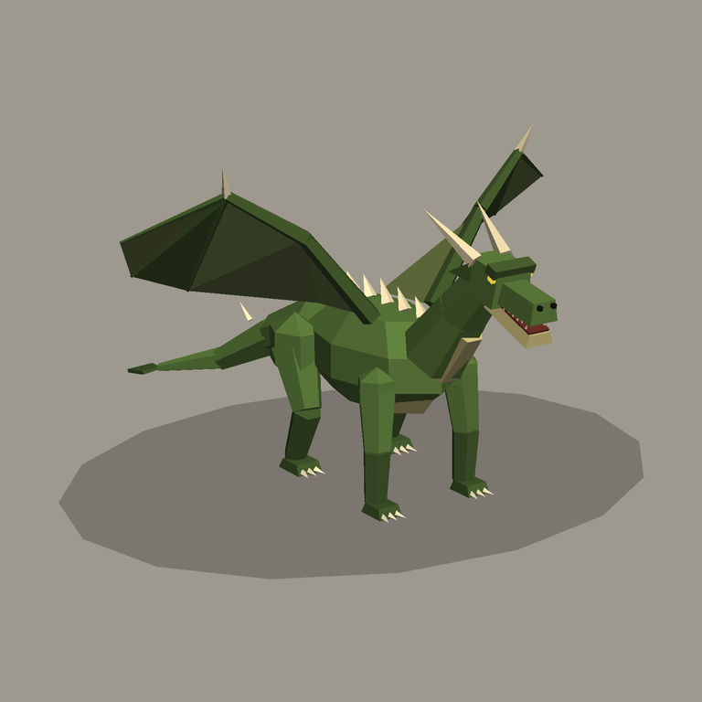

*Entry-tier dragon: lean quadruped, long two-joint neck, swept-back horns, half-spread bat wings, spade-tipped tail.*

| | |
|---|---|
| Concept image | `images/dragon_green.png` |
| Reference code | `code/monsters/defs/dragons.py` -> `build_dragon_green()` |
| Size class / anim profile | large / `dragon` |
| Dimensions (W x L x H) | 3.90 x 4.41 x 2.65 m (design height 2.9 m = 1.61x player) |
| Triangles | **1044** (budget 800-1500 (hard max 2000)) |
| Joints | 20 (unlit/emissive: `eyes`) |

**Silhouette.** Horizontal wedge: low head thrust forward, two big wing triangles rising from the shoulders, tail tapering to a spade. Reads as 'dragon' from any angle thanks to the wing triangles + horns.

**Body parts.** Body = one 5x8 ellipsoid + lighter belly ellipsoid offset down; 6 dorsal spike cones. Neck = 2 tapered tubes with a belly strip. Head = tapered skull box + tapered snout box + brow ridge, 2 long horn cones, cheek frills (prism), 3 teeth per side, separate `jaw` joint, unlit `eyes` joint. Legs = sphere shoulder + thigh tube -> shin joint (tube + foot box + 3 claw cones); hind legs digitigrade (thigh forward, shin back). Wings = bone tubes shoulder->elbow->wrist + 3 finger tubes, 4 double-sided membrane polygons. Tail = 3 joints, each turned +8..18 deg heading so the tail curls.

**Node hierarchy** (joint name @ position relative to parent, metres):

```text
root
  body  @(0.00, 0.00, 1.05)
    neck_0  @(0.00, 0.72, 0.18)
      neck_1  @(0.00, 0.32, 0.38)
        head  @(0.00, 0.28, 0.30)
          eyes  @(0.00, 0.20, 0.11)
          jaw  @(0.00, 0.12, -0.08)
    l_front_leg  @(-0.38, 0.50, -0.10)
      l_front_shin  @(-0.03, 0.05, -0.45)
    l_hind_leg  @(-0.40, -0.55, -0.02)
      l_hind_shin  @(-0.04, 0.22, -0.46)
    r_front_leg  @(0.38, 0.50, -0.10)
      r_front_shin  @(0.03, 0.05, -0.45)
    r_hind_leg  @(0.40, -0.55, -0.02)
      r_hind_shin  @(0.04, 0.22, -0.46)
    l_wing  @(-0.28, 0.30, 0.38)
    r_wing  @(0.28, 0.30, 0.38)
    tail_0  @(0.00, -0.78, 0.02)
      tail_1  @(0.00, -0.55, -0.20)
        tail_2  @(0.00, -0.55, -0.30)
```

**Palette**

| role | hex |
|---|---|
| body | `#4f6b35` |
| dark | `#3a4f28` |
| belly | `#a39a68` |
| wing | `#667543` |
| wing_bone | `#3a4f28` |
| horn | `#cfc3a0` |
| eye | `#e3c243` |
| claw | `#d6ccb0` |
| mouth | `#5a2a22` |

**Animation.** idle: slow breathing on body, head sway, jaw opening slightly, wings pendulum +-8 deg roll. walk: diagonal leg pairs (l_front+r_hind vs r_front+l_hind) +-22 deg pitch at 1.25 s/cycle, tail swing. attack: rear back (neck_0 +25, wings flare 25 deg), lunge, jaw -35 deg; spawn the dragonfire projectile/particles during the 0.5 s hold. death: fall_over (roll 85 deg + sink, hide after 1.2 s).

**Combat (suggested)**

| Level | HP | Attack style | Max hit | Attack speed | Weakness | Aggressive |
|---|---|---|---|---|---|---|
| 68 | 80 | melee (slash) + dragonfire | 8 | 2.4 s | stab / ranged; anti-dragon shield vs fire | yes |

Notes: Dragonfire max 50 without anti-dragon shield. Green = the 'first real dragon' - teach players the anti-dragon shield mechanic.

#### 4.2 Red Dragon (`dragon_red`)

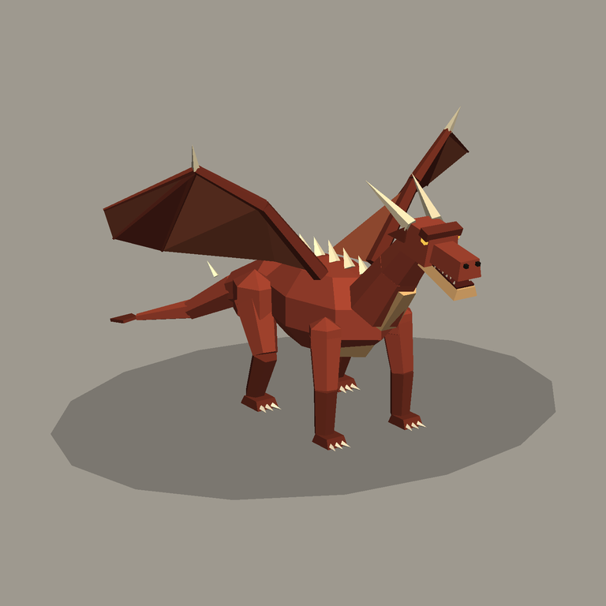

*Mid-tier dragon: same rig as green at 1.15x scale, rust-red scales, sandy belly.*

| | |
|---|---|
| Concept image | `images/dragon_red.png` |
| Reference code | `code/monsters/defs/dragons.py` -> `build_dragon_red()` |
| Size class / anim profile | large / `dragon` |
| Dimensions (W x L x H) | 4.49 x 5.08 x 3.05 m (design height 3.3 m = 1.83x player) |
| Triangles | **1044** (budget 800-1500 (hard max 2000)) |
| Joints | 20 (unlit/emissive: `eyes`) |

**Silhouette.** As green dragon but bigger; colour is the main tier signal, so keep the palettes strictly distinct in hue.

**Body parts.** Identical hierarchy to dragon_green (shared `_dragon()` builder, s=1.15).

**Node hierarchy** (joint name @ position relative to parent, metres):

```text
root
  body  @(0.00, 0.00, 1.21)
    neck_0  @(0.00, 0.83, 0.21)
      neck_1  @(0.00, 0.37, 0.44)
        head  @(0.00, 0.32, 0.34)
          eyes  @(0.00, 0.23, 0.13)
          jaw  @(0.00, 0.14, -0.09)
    l_front_leg  @(-0.44, 0.57, -0.12)
      l_front_shin  @(-0.03, 0.06, -0.52)
    l_hind_leg  @(-0.46, -0.63, -0.02)
      l_hind_shin  @(-0.05, 0.25, -0.53)
    r_front_leg  @(0.44, 0.57, -0.12)
      r_front_shin  @(0.03, 0.06, -0.52)
    r_hind_leg  @(0.46, -0.63, -0.02)
      r_hind_shin  @(0.05, 0.25, -0.53)
    l_wing  @(-0.32, 0.34, 0.44)
    r_wing  @(0.32, 0.34, 0.44)
    tail_0  @(0.00, -0.90, 0.02)
      tail_1  @(0.00, -0.63, -0.23)
        tail_2  @(0.00, -0.63, -0.34)
```

**Palette**

| role | hex |
|---|---|
| body | `#8c3b2a` |
| dark | `#62291d` |
| belly | `#c49a64` |
| wing | `#9e5236` |
| wing_bone | `#62291d` |
| horn | `#d8cba5` |
| eye | `#f2c14a` |
| claw | `#dcd0b2` |
| mouth | `#4a1d18` |

**Animation.** As green; play walk ~10% slower (heavier). Fire breath leaves a burning patch (gameplay).

**Combat (suggested)**

| Level | HP | Attack style | Max hit | Attack speed | Weakness | Aggressive |
|---|---|---|---|---|---|---|
| 118 | 130 | melee (slash) + dragonfire | 13 | 2.4 s | stab / ranged; anti-dragon shield vs fire | yes |

Notes: Fire breath sets a 3x3 burning patch. Colour-tier variant; zero new modelling work.

#### 4.3 Black Dragon (`dragon_black`)

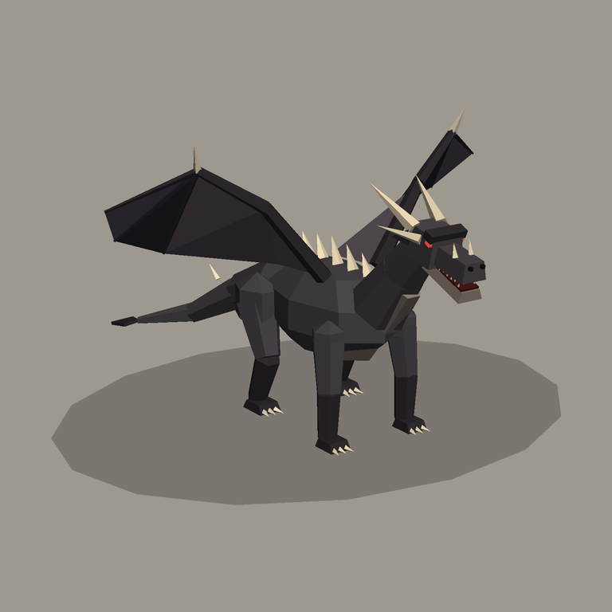

*Top-tier/boss dragon: 1.45x scale, charcoal scales, extra horn pair and snout spikes, red glowing eyes, taller dorsal spikes.*

| | |
|---|---|
| Concept image | `images/dragon_black.png` |
| Reference code | `code/monsters/defs/dragons.py` -> `build_dragon_black()` |
| Size class / anim profile | boss / `dragon` |
| Dimensions (W x L x H) | 5.66 x 6.40 x 3.84 m (design height 4.3 m = 2.39x player) |
| Triangles | **1068** (budget 1000-2500 (hard max 3000)) |
| Joints | 20 (unlit/emissive: `eyes`) |

**Silhouette.** Largest thing in the bestiary; extra horns make the head crown read at distance. Eyes glow red (unlit) so the face reads against the dark body.

**Body parts.** dragon_green hierarchy with `elder=True`: +2 side horns, +2 snout spikes, dorsal spikes +0.06 m.

**Node hierarchy** (joint name @ position relative to parent, metres):

```text
root
  body  @(0.00, 0.00, 1.52)
    neck_0  @(0.00, 1.04, 0.26)
      neck_1  @(0.00, 0.46, 0.55)
        head  @(0.00, 0.41, 0.44)
          eyes  @(0.00, 0.29, 0.16)
          jaw  @(0.00, 0.17, -0.12)
    l_front_leg  @(-0.55, 0.73, -0.14)
      l_front_shin  @(-0.04, 0.07, -0.65)
    l_hind_leg  @(-0.58, -0.80, -0.03)
      l_hind_shin  @(-0.06, 0.32, -0.67)
    r_front_leg  @(0.55, 0.73, -0.14)
      r_front_shin  @(0.04, 0.07, -0.65)
    r_hind_leg  @(0.58, -0.80, -0.03)
      r_hind_shin  @(0.06, 0.32, -0.67)
    l_wing  @(-0.41, 0.44, 0.55)
    r_wing  @(0.41, 0.44, 0.55)
    tail_0  @(0.00, -1.13, 0.03)
      tail_1  @(0.00, -0.80, -0.29)
        tail_2  @(0.00, -0.80, -0.44)
```

**Palette**

| role | hex |
|---|---|
| body | `#3b393e` |
| dark | `#262428` |
| belly | `#6a625a` |
| wing | `#57505a` |
| wing_bone | `#262428` |
| horn | `#bfb49a` |
| eye | `#d8452f` |
| claw | `#c9bfa6` |
| mouth | `#3a1512` |

**Animation.** As green; walk at 0.7x speed; attack hold 0.7 s. Consider a second attack: wing buffet (both wings roll 35 deg forward then back).

**Combat (suggested)**

| Level | HP | Attack style | Max hit | Attack speed | Weakness | Aggressive |
|---|---|---|---|---|---|---|
| 175 | 200 | melee (slash) + dragonfire | 20 | 2.4 s | stab / ranged / water spells | yes |

Notes: Breath alternates fire / poison. Slayer-tier. Keep the body a lighter charcoal (#3b393e), not pure black, or all facets merge into one blob.


### Goblins

#### 4.4 Goblin Grunt (`goblin_grunt`)

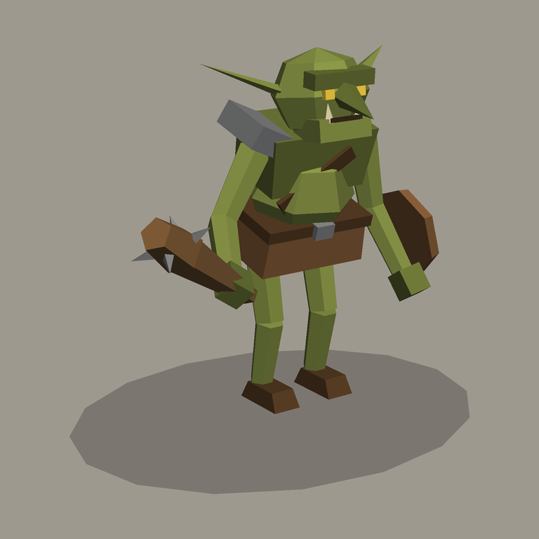

*Low-level hunched goblin with a spiked club, hide shield, rusty pauldron and leather kilt.*

| | |
|---|---|
| Concept image | `images/goblin_grunt.png` |
| Reference code | `code/monsters/defs/goblins.py` -> `build_goblin_grunt()` |
| Size class / anim profile | small / `biped` |
| Dimensions (W x L x H) | 1.24 x 0.72 x 1.19 m (design height 1.15 m = 0.64x player) |
| Triangles | **544** (budget 300-700 (hard max 800)) |
| Joints | 14 (unlit/emissive: none) |

**Silhouette.** Top-heavy: oversized head with long horizontal ears and a hooked nose, pot belly, long arms, short bandy legs. Club held out to the side so the weapon breaks the outline.

**Body parts.** hips -> legs (thigh+shin+boot box); torso (belly sphere + tapered chest box, kilt, belt, pauldron, strap) leaning 16 deg forward; head (7-seg skull sphere, brow, nose cone, jaw box, tusks, ears as squashed cones, eye boxes); arms shoulder->forearm->hand joint; club on `r_hand` (aimed with `aim()`), shield on `l_forearm`.

**Node hierarchy** (joint name @ position relative to parent, metres):

```text
root
  hips  @(0.00, 0.00, 0.50)
    l_leg  @(-0.11, 0.00, -0.02)
      l_shin  @(0.00, 0.00, -0.24)
    r_leg  @(0.11, 0.00, -0.02)
      r_shin  @(0.00, 0.00, -0.24)
    torso  @(0.00, 0.00, 0.02)
      head  @(0.00, 0.05, 0.40)
      l_arm  @(-0.21, 0.02, 0.34)
        l_forearm  @(0.00, 0.00, -0.25)
          l_hand  @(0.00, 0.01, -0.28)
      r_arm  @(0.21, 0.02, 0.34)
        r_forearm  @(0.00, 0.00, -0.25)
          r_hand  @(0.00, 0.01, -0.28)
```

**Palette**

| role | hex |
|---|---|
| skin | `#6e7b3c` |
| skin_dark | `#57622f` |
| leather | `#6b4c30` |
| leather_dark | `#47331f` |
| iron | `#6d7072` |
| bone | `#d3c8a6` |
| eye | `#d8b93c` |
| wood | `#6f5232` |
| mouth | `#2e2418` |

**Animation.** idle: torso breathing, head turn, arms sway. walk: 0.9 s cycle, legs +-25 deg, arms counter-swing +-18 deg, slight torso twist. attack: wind-up r_arm +70 pitch / torso turn 15 deg, fast 0.15 s swing down. death: fall_over.

**Combat (suggested)**

| Level | HP | Attack style | Max hit | Attack speed | Weakness | Aggressive |
|---|---|---|---|---|---|---|
| 5 | 12 | melee (crush) | 2 | 2.4 s | stab / fire spells | yes |

Notes: Travels in packs of 3-5. Spawn in packs; cheap (544 tris) so 10+ on screen is fine.

#### 4.5 Goblin Shaman (`goblin_shaman`)

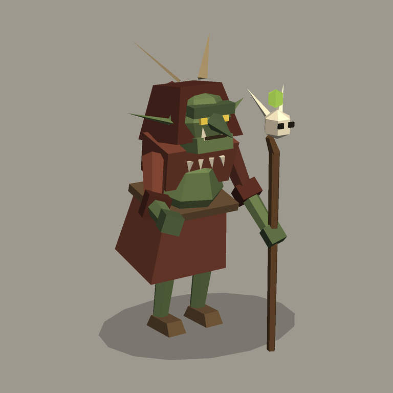

*Goblin caster in a ragged rust-brown robe and hood with feathers, bone necklace, skull staff with a glowing green orb.*

| | |
|---|---|
| Concept image | `images/goblin_shaman.png` |
| Reference code | `code/monsters/defs/goblins.py` -> `build_goblin_shaman()` |
| Size class / anim profile | small / `biped` |
| Dimensions (W x L x H) | 0.92 x 0.83 x 1.58 m (design height 1.35 m = 0.75x player) |
| Triangles | **612** (budget 300-700 (hard max 800)) |
| Joints | 15 (unlit/emissive: `staff_orb`) |

**Silhouette.** Triangle robe skirt + hood + tall staff: instantly distinct from the grunt at thumbnail size even though the head is shared.

**Body parts.** Same base as grunt (`_goblin_body(shaman=True)`): robe skirt frustum, rope belt, necklace cones, hood box + drooping hood tail, feathers; staff on `l_hand` with skull, horns and `staff_orb` joint (unlit, glows).

**Node hierarchy** (joint name @ position relative to parent, metres):

```text
root
  hips  @(0.00, 0.00, 0.50)
    l_leg  @(-0.11, 0.00, -0.02)
      l_shin  @(0.00, 0.00, -0.24)
    r_leg  @(0.11, 0.00, -0.02)
      r_shin  @(0.00, 0.00, -0.24)
    torso  @(0.00, 0.00, 0.02)
      head  @(0.00, 0.05, 0.40)
      l_arm  @(-0.21, 0.02, 0.34)
        l_forearm  @(0.00, 0.00, -0.25)
          l_hand  @(0.00, 0.01, -0.28)
            staff_orb  @(0.00, 0.00, 0.68)
      r_arm  @(0.21, 0.02, 0.34)
        r_forearm  @(0.00, 0.00, -0.25)
          r_hand  @(0.00, 0.01, -0.28)
```

**Palette**

| role | hex |
|---|---|
| skin | `#5d6f45` |
| skin_dark | `#48583a` |
| robe | `#6a3a2c` |
| robe_dark | `#4b271e` |
| leather | `#5a4630` |
| bone | `#d9d0b3` |
| eye | `#e0c34a` |
| wood | `#5b4128` |
| feather | `#8a7a5a` |
| orb | `#9cc24e` |
| mouth | `#2e2418` |

**Animation.** idle: as grunt + orb bob (optional LerpPosInterval on staff_orb). attack: raise r_arm (casting hand) +70 pitch, thrust; spawn a green bolt from staff_orb world position. death: fall_over; hide the orb glow first.

**Combat (suggested)**

| Level | HP | Attack style | Max hit | Attack speed | Weakness | Aggressive |
|---|---|---|---|---|---|---|
| 13 | 22 | magic (earth bolt) | 4 | 3.0 s | melee (slash) | yes |

Notes: Heals nearby goblins for 2 every 10 s. Heals allies - give it a distinct cast sound and green particle.


### Skeletons

#### 4.6 Skeleton Warrior (`skeleton_warrior`)

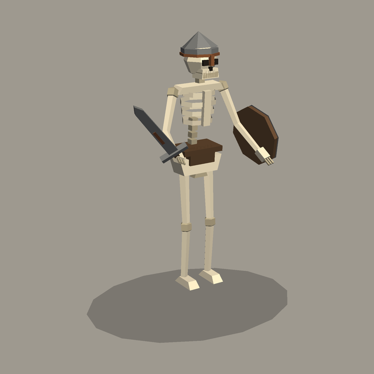

*Human skeleton with rusty conical helm, notched longsword and a round wooden shield.*

| | |
|---|---|
| Concept image | `images/skeleton_warrior.png` |
| Reference code | `code/monsters/defs/skeletons.py` -> `build_skeleton_warrior()` |
| Size class / anim profile | medium / `biped` |
| Dimensions (W x L x H) | 1.43 x 0.86 x 1.92 m (design height 1.85 m = 1.03x player) |
| Triangles | **950** (budget 500-1000 (hard max 1200)) |
| Joints | 15 (unlit/emissive: none) |

**Silhouette.** Thin vertical figure; hollow ribcage (open double-sided rings) lets the background show through, which is the key 'skeleton' read. Sword and shield widen the silhouette.

**Body parts.** hips (pelvis frustum) -> legs with knee spheres; torso = 5 vertebra boxes + 4 double-sided rib rings + sternum + collar bar; head = skull sphere + maxilla box + socket boxes, separate `jaw` joint (clatters), kettle helm (tube+cone+rust band+nasal); arms thin tubes with finger boxes; sword prism on `r_hand`, shield (tube disc + rim + boss) on `l_forearm`.

**Node hierarchy** (joint name @ position relative to parent, metres):

```text
root
  hips  @(0.00, 0.00, 0.94)
    l_leg  @(-0.11, 0.00, -0.04)
      l_shin  @(0.00, 0.00, -0.43)
    r_leg  @(0.11, 0.00, -0.04)
      r_shin  @(0.00, 0.00, -0.43)
    torso  @(0.00, 0.00, 0.06)
      head  @(0.00, 0.02, 0.60)
        jaw  @(0.00, 0.00, 0.05)
      l_arm  @(-0.22, -0.01, 0.50)
        l_forearm  @(0.00, 0.00, -0.30)
          l_hand  @(0.00, 0.01, -0.32)
      r_arm  @(0.22, -0.01, 0.50)
        r_forearm  @(0.00, 0.00, -0.30)
          r_hand  @(0.00, 0.01, -0.32)
```

**Palette**

| role | hex |
|---|---|
| bone | `#d6cdb2` |
| bone_dark | `#a39a7f` |
| socket | `#221e19` |
| iron | `#707271` |
| rust | `#7b4d2f` |
| wood | `#5e4630` |
| leather | `#4f3b28` |

**Animation.** idle: slight sway + jaw chatter (swing jaw -6 deg). walk: stiff, legs +-25, arms +-18. attack: overhead slash (biped_attack). death: instead of fall_over, collapse: set every limb joint to random hpr and drop pelvis to 0.1 m in 0.3 s (bones pile) - optional upgrade.

**Combat (suggested)**

| Level | HP | Attack style | Max hit | Attack speed | Weakness | Aggressive |
|---|---|---|---|---|---|---|
| 24 | 32 | melee (slash) | 5 | 2.4 s | crush weapons | yes |

Notes: Immune to poison. Reassembles once if not finished with crush. Weak to crush - consider a 'reassemble' mechanic.

#### 4.7 Skeleton Mage (`skeleton_mage`)

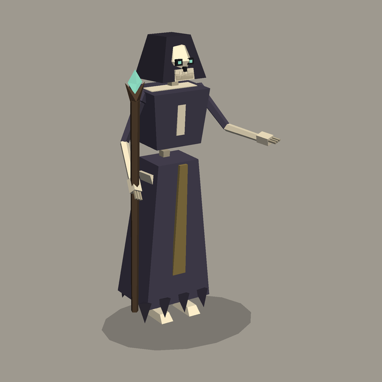

*Robed skeleton necromancer: dark violet robe and hood with gold trim, pale green glowing eye sockets and staff crystal.*

| | |
|---|---|
| Concept image | `images/skeleton_mage.png` |
| Reference code | `code/monsters/defs/skeletons.py` -> `build_skeleton_mage()` |
| Size class / anim profile | medium / `biped` |
| Dimensions (W x L x H) | 0.96 x 0.87 x 1.87 m (design height 1.85 m = 1.03x player) |
| Triangles | **872** (budget 500-1000 (hard max 1200)) |
| Joints | 17 (unlit/emissive: `eyes`, `staff_gem`) |

**Silhouette.** Tall robed column + staff + one outstretched bony arm (casting). The robe hides the legs, so it glides rather than walks.

**Body parts.** Skeleton base with `mage=True`: robe top frustum, long robe skirt frustum with ragged hem cones and trim strip, hood box + tail, unlit `eyes` joint, staff on `r_hand` with forked top and unlit `staff_gem` joint.

**Node hierarchy** (joint name @ position relative to parent, metres):

```text
root
  hips  @(0.00, 0.00, 0.94)
    l_leg  @(-0.11, 0.00, -0.04)
      l_shin  @(0.00, 0.00, -0.43)
    r_leg  @(0.11, 0.00, -0.04)
      r_shin  @(0.00, 0.00, -0.43)
    torso  @(0.00, 0.00, 0.06)
      head  @(0.00, 0.02, 0.60)
        jaw  @(0.00, 0.00, 0.05)
        eyes  @(0.00, 0.12, 0.12)
      l_arm  @(-0.22, -0.01, 0.50)
        l_forearm  @(0.00, 0.00, -0.30)
          l_hand  @(0.00, 0.01, -0.32)
      r_arm  @(0.22, -0.01, 0.50)
        r_forearm  @(0.00, 0.00, -0.30)
          r_hand  @(0.00, 0.01, -0.32)
            staff_gem  @(0.00, 0.00, 0.66)
```

**Palette**

| role | hex |
|---|---|
| bone | `#cfc8b0` |
| bone_dark | `#9c9580` |
| socket | `#1a1a1d` |
| robe | `#3d3a4a` |
| robe_dark | `#2a2833` |
| trim | `#7a6a3e` |
| wood | `#4a3a2c` |
| glow | `#86d1b8` |

**Animation.** idle: sway, left (casting) arm hovers. walk: reduce leg swing to +-10 (robe hides it) and add body bob 0.02 m. attack: l_arm thrust forward, bolt spawns from staff_gem. death: fall_over.

**Combat (suggested)**

| Level | HP | Attack style | Max hit | Attack speed | Weakness | Aggressive |
|---|---|---|---|---|---|---|
| 34 | 38 | magic (necrotic bolt) | 8 | 3.0 s | crush + ranged | yes |

Notes: Keeps 3-4 tiles distance; drains Prayer on hit. Keeps distance - pair with warriors in crypts.


### Spiders

#### 4.8 Giant Spider (`spider_giant`)

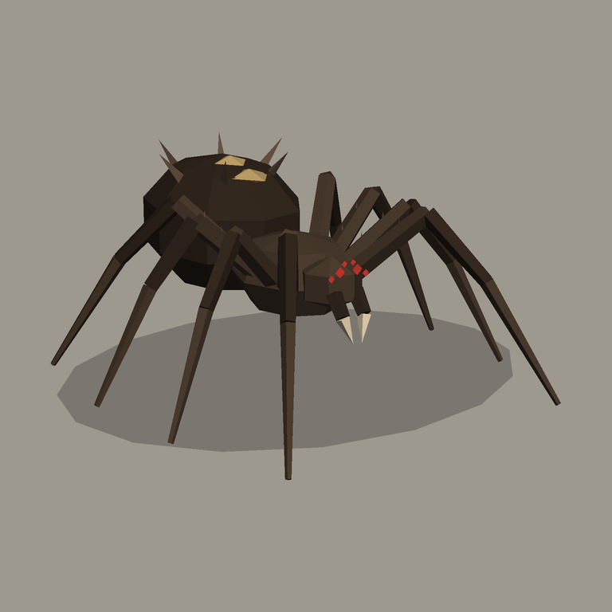

*Dog-sized brown spider with a bristly abdomen, pale chevron markings, red eye cluster and ivory fangs.*

| | |
|---|---|
| Concept image | `images/spider_giant.png` |
| Reference code | `code/monsters/defs/spiders.py` -> `build_spider_giant()` |
| Size class / anim profile | medium / `spider` |
| Dimensions (W x L x H) | 1.66 x 1.76 x 0.85 m (design height 0.75 m = 0.42x player) |
| Triangles | **744** (budget 500-1000 (hard max 1200)) |
| Joints | 20 (unlit/emissive: `eyes`) |

**Silhouette.** Wide and low: eight long legs arching up to high knees then down; the leg 'cage' is the silhouette. Abdomen bigger than the cephalothorax.

**Body parts.** body joint (cephalothorax + abdomen ellipsoids, diamond markings, bristle cones) -> head (fangs + unlit eye cluster) -> 8x `leg_<l|r><0-3>` (femur rises 42 deg) -> `knee_*` (two-part tibia to the ground). Legs are generated from heading angles (55, 22, -12, -45).

**Node hierarchy** (joint name @ position relative to parent, metres):

```text
root
  body  @(0.00, 0.00, 0.42)
    head  @(0.00, 0.34, 0.02)
      eyes  @(0.00, 0.11, 0.05)
    leg_l0  @(-0.14, 0.26, 0.00)
      knee_l0  @(0.31, 0.00, 0.28)
    leg_l1  @(-0.14, 0.19, 0.00)
      knee_l1  @(0.29, 0.00, 0.26)
    leg_l2  @(-0.14, 0.11, 0.00)
      knee_l2  @(0.29, 0.00, 0.26)
    leg_l3  @(-0.14, 0.04, 0.00)
      knee_l3  @(0.31, 0.00, 0.28)
    leg_r0  @(0.14, 0.26, 0.00)
      knee_r0  @(0.31, 0.00, 0.28)
    leg_r1  @(0.14, 0.19, 0.00)
      knee_r1  @(0.29, 0.00, 0.26)
    leg_r2  @(0.14, 0.11, 0.00)
      knee_r2  @(0.29, 0.00, 0.26)
    leg_r3  @(0.14, 0.04, 0.00)
      knee_r3  @(0.31, 0.00, 0.28)
```

**Palette**

| role | hex |
|---|---|
| body | `#3d3228` |
| body_dark | `#2a221b` |
| hair | `#54463a` |
| mark | `#9a8458` |
| fang | `#c9bda0` |
| eye | `#b8322a` |

**Animation.** idle: body bob, head twitch. walk: alternating tetrapod gait - group A (l0, r1, l2, r3) vs group B swing heading +-14 deg and knee roll +-10 deg, 0.6 s cycle. attack: rear up (body pitch +15), stab down. death: spider_death - flip onto back, curl legs.

**Combat (suggested)**

| Level | HP | Attack style | Max hit | Attack speed | Weakness | Aggressive |
|---|---|---|---|---|---|---|
| 26 | 36 | melee (stab) + poison | 5 | 1.8 s | slash / fire | yes |

Notes: Poison 4. Webs slow the player for 3 ticks. Fast attacker, poison; webs in the lair are cheap flat quads.

#### 4.9 Spider Broodmother (`spider_broodmother`)

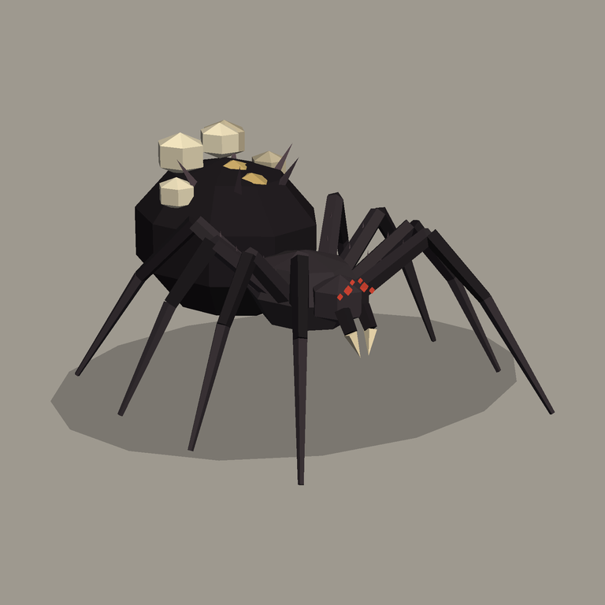

*Huge (1.7x) near-black spider queen with a bloated abdomen carrying silk egg sacs; spawns hatchlings.*

| | |
|---|---|
| Concept image | `images/spider_broodmother.png` |
| Reference code | `code/monsters/defs/spiders.py` -> `build_spider_broodmother()` |
| Size class / anim profile | large / `spider` |
| Dimensions (W x L x H) | 2.82 x 3.29 x 1.76 m (design height 1.4 m = 0.78x player) |
| Triangles | **864** (budget 800-1500 (hard max 2000)) |
| Joints | 20 (unlit/emissive: `eyes`) |

**Silhouette.** Giant spider silhouette plus a lumpy egg-sac crown on the abdomen - reads as 'boss spider' instantly.

**Body parts.** Same `_spider()` builder with s=1.7, brood=True: bigger abdomen shifted back, 5 egg-sac ellipsoids.

**Node hierarchy** (joint name @ position relative to parent, metres):

```text
root
  body  @(0.00, 0.00, 0.71)
    head  @(0.00, 0.58, 0.03)
      eyes  @(0.00, 0.19, 0.09)
    leg_l0  @(-0.24, 0.44, 0.00)
      knee_l0  @(0.53, 0.00, 0.48)
    leg_l1  @(-0.24, 0.31, 0.00)
      knee_l1  @(0.49, 0.00, 0.44)
    leg_l2  @(-0.24, 0.19, 0.00)
      knee_l2  @(0.49, 0.00, 0.44)
    leg_l3  @(-0.24, 0.06, 0.00)
      knee_l3  @(0.53, 0.00, 0.48)
    leg_r0  @(0.24, 0.44, 0.00)
      knee_r0  @(0.53, 0.00, 0.48)
    leg_r1  @(0.24, 0.31, 0.00)
      knee_r1  @(0.49, 0.00, 0.44)
    leg_r2  @(0.24, 0.19, 0.00)
      knee_r2  @(0.49, 0.00, 0.44)
    leg_r3  @(0.24, 0.06, 0.00)
      knee_r3  @(0.53, 0.00, 0.48)
```

**Palette**

| role | hex |
|---|---|
| body | `#2f2a2e` |
| body_dark | `#1d1a1d` |
| hair | `#4a3f45` |
| mark | `#a6905a` |
| fang | `#d4c7a4` |
| eye | `#c2402f` |
| egg | `#c9c2a8` |
| egg_dark | `#9f977f` |

**Animation.** As giant spider at 0.8x speed. Extra: 'lay eggs' special - body pitch -10 deg for 1 s while hatchlings spawn behind.

**Combat (suggested)**

| Level | HP | Attack style | Max hit | Attack speed | Weakness | Aggressive |
|---|---|---|---|---|---|---|
| 62 | 140 | melee (stab) + poison | 14 | 2.4 s | slash / fire | yes |

Notes: Spawns 2 hatchlings (lvl 8) at 50% HP. Poison 8. Hatchlings can reuse spider_giant at scale 0.4.


### Void monsters

#### 4.10 Void Spawn (`void_spawn`)

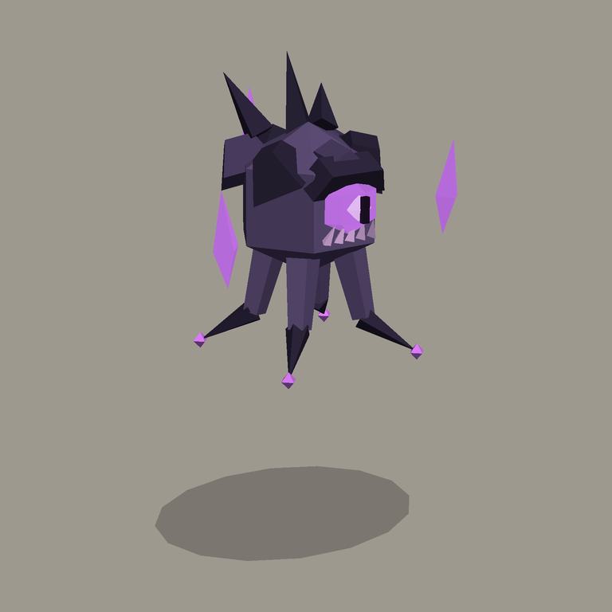

*Small floating void horror: a jagged plated shell around one big glowing eye, a ring of teeth, curling tentacles and orbiting crystal shards.*

| | |
|---|---|
| Concept image | `images/void_spawn.png` |
| Reference code | `code/monsters/defs/void.py` -> `build_void_spawn()` |
| Size class / anim profile | small / `floater` |
| Dimensions (W x L x H) | 0.92 x 0.88 x 1.07 m (design height 1.1 m = 0.61x player) |
| Triangles | **360** (budget 300-700 (hard max 800)) |
| Joints | 12 (unlit/emissive: `eye`, `shards`) |

**Silhouette.** Spiky top, round eye, tentacles curling outward below, floating clear of its ground shadow; shards orbit around it.

**Body parts.** body (flesh ellipsoid + 6 tilted shell plates + 3 dorsal crystals + brow plate + teeth) -> unlit `eye`; 4x `tentacle_i` -> `tentacle_i_tip` with glow bead; unlit `shards` joint that spins.

**Node hierarchy** (joint name @ position relative to parent, metres):

```text
root
  body  @(0.00, 0.00, 1.20)
    eye  @(0.00, 0.24, 0.02)
    tentacle_0  @(0.10, 0.10, -0.18)
      tentacle_0_tip  @(0.04, 0.04, -0.24)
    tentacle_1  @(-0.10, 0.10, -0.18)
      tentacle_1_tip  @(-0.04, 0.04, -0.24)
    tentacle_2  @(-0.10, -0.10, -0.18)
      tentacle_2_tip  @(-0.04, -0.04, -0.24)
    tentacle_3  @(0.10, -0.10, -0.18)
      tentacle_3_tip  @(0.04, -0.04, -0.24)
    shards  @(0.00, 0.00, 0.00)
```

**Palette**

| role | hex |
|---|---|
| shell | `#3a3150` |
| shell_dark | `#241f33` |
| flesh | `#4d4166` |
| glow | `#b56ad9` |
| glow_core | `#e0b8f0` |
| pupil | `#1a0f22` |

**Animation.** floater profile: idle bob +-0.08 m / 2 s, tentacles pendulum out of phase, shards rotate 360 deg / 4 s. walk: idle + 12 deg forward lean. attack: lunge; flash the eye (swap colour scale to 1.5 for 0.1 s). death: floater_death - spin, rise, shrink to nothing.

**Combat (suggested)**

| Level | HP | Attack style | Max hit | Attack speed | Weakness | Aggressive |
|---|---|---|---|---|---|---|
| 38 | 30 | magic (void pulse) | 6 | 2.4 s | slash / light (holy) spells | yes |

Notes: Explodes on death for 1-5 to adjacent players. Explodes on death - telegraph with the eye flashing.

#### 4.11 Void Brute (`void_brute`)

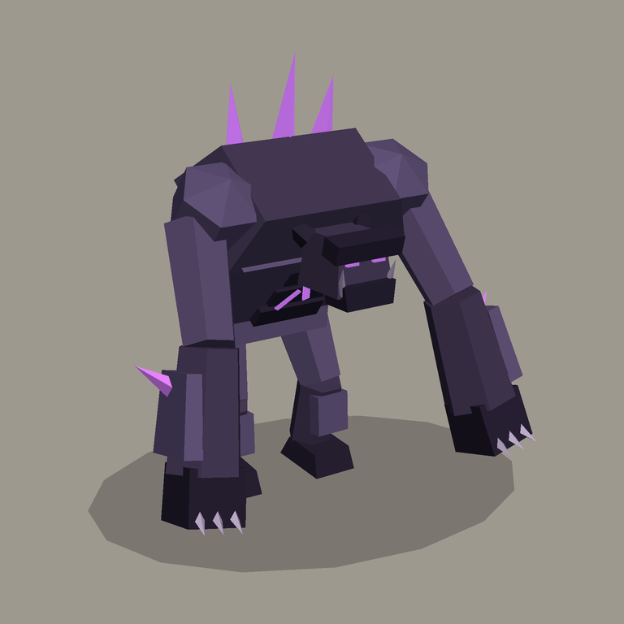

*2.3 m knuckle-walking void hulk: dark violet hide, carapace plates, crystal spikes growing from its back, glowing cracks and eyes.*

| | |
|---|---|
| Concept image | `images/void_brute.png` |
| Reference code | `code/monsters/defs/void.py` -> `build_void_brute()` |
| Size class / anim profile | large / `biped` |
| Dimensions (W x L x H) | 2.19 x 1.33 x 2.35 m (design height 2.3 m = 1.28x player) |
| Triangles | **558** (budget 800-1500 (hard max 2000)) |
| Joints | 15 (unlit/emissive: `crystals`, `cracks`, `eyes`) |

**Silhouette.** Gorilla mass: enormous shoulders and forearms, small sunken head, glowing crystal spikes on the back. Arms longer than legs.

**Body parts.** hips -> short thick legs with shin plates; torso pitched -38 deg (hide frustum + shoulder yoke + shoulder spheres + belly plates) -> unlit `crystals`, unlit `cracks`, head (shell box, brow, jaw, tusks, horns) -> unlit `eyes`; arms upper -> forearm (fist box, 3 claws, forearm plate, glow spike).

**Node hierarchy** (joint name @ position relative to parent, metres):

```text
root
  hips  @(0.00, 0.00, 0.92)
    l_leg  @(-0.26, 0.00, -0.08)
      l_shin  @(0.00, 0.08, -0.42)
    r_leg  @(0.26, 0.00, -0.08)
      r_shin  @(0.00, 0.08, -0.42)
    torso  @(0.00, 0.00, 0.10)
      crystals  @(0.00, -0.25, 0.62)
      cracks  @(0.00, 0.31, 0.36)
      head  @(0.00, 0.36, 0.66)
        eyes  @(0.00, 0.26, 0.03)
      l_arm  @(-0.62, 0.02, 0.62)
        l_forearm  @(0.00, 0.00, -0.62)
      r_arm  @(0.62, 0.02, 0.62)
        r_forearm  @(0.00, 0.00, -0.62)
```

**Palette**

| role | hex |
|---|---|
| shell | `#383049` |
| shell_dark | `#211c2d` |
| hide | `#4a4060` |
| plate | `#4f4568` |
| glow | `#b56ad9` |
| claw | `#9d93b3` |

**Animation.** biped profile. walk: slow 1.2 s cycle, use arms as front legs (arms swing in phase with the opposite leg, +-20 deg). attack: both arms raise (+70) then slam (-40) - ground-slam AoE on impact frame. death: fall_over forward (use pitch -80 instead of roll).

**Combat (suggested)**

| Level | HP | Attack style | Max hit | Attack speed | Weakness | Aggressive |
|---|---|---|---|---|---|---|
| 98 | 150 | melee (crush) | 18 | 3.0 s | stab / light (holy) spells | yes |

Notes: Ground slam hits all adjacent tiles every 5th attack. Mid-game gatekeeper of the void area.


### Giants

#### 4.12 Hill Giant (`giant_hill`)

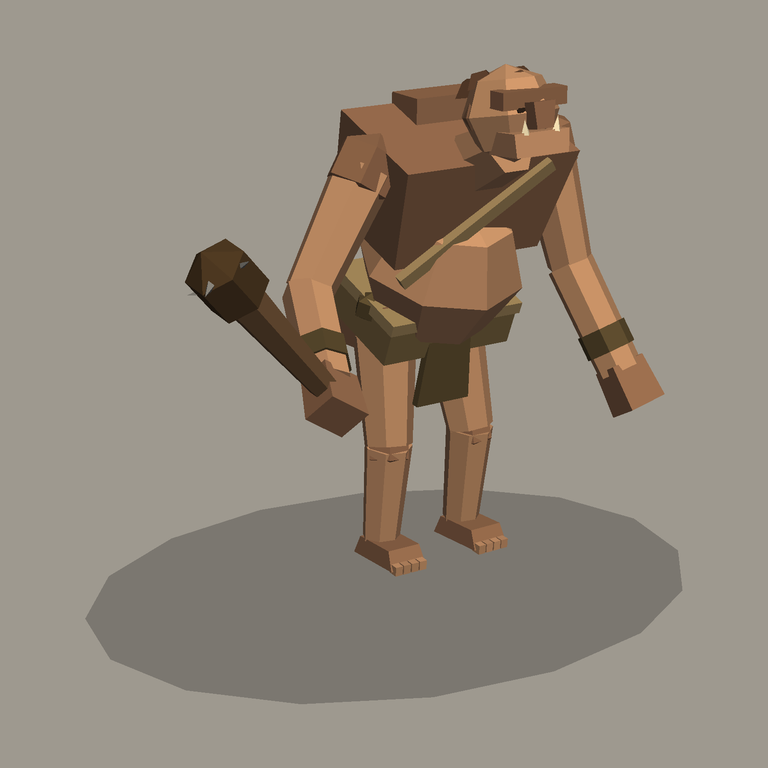

*4 m hunched brute with a pot belly, shaggy mop, tusked underbite, rope-belted loincloth and a nail-studded log club.*

| | |
|---|---|
| Concept image | `images/giant_hill.png` |
| Reference code | `code/monsters/defs/giants.py` -> `build_giant_hill()` |
| Size class / anim profile | large / `giant` |
| Dimensions (W x L x H) | 4.10 x 2.09 x 3.75 m (design height 4.0 m = 2.22x player) |
| Triangles | **938** (budget 800-1500 (hard max 2000)) |
| Joints | 16 (unlit/emissive: none) |

**Silhouette.** Massive rectangular chest and shoulders over short bowed legs, small head pushed forward and low (hunched), long arms; the raised club breaks the outline on one side.

**Body parts.** hips slab -> thick legs (thigh + knee sphere -> shin + bare foot with 4 toe boxes); torso leaning -22 deg (belly sphere, tapered chest box, hunched back box, thick neck tube, loincloth + front flap, rope belt, chest strap, belt pouch) -> head (8x7 skull, brow slab, nose, ears, shaggy hair boxes) -> `jaw` (tusks), empty `eyes` joint (kept for API parity); arms shoulder sphere -> forearm (wrist wrap, fist box) -> `r_hand` club (log tube, knotted head, nails, grip binding), aimed with `aim()`.

**Node hierarchy** (joint name @ position relative to parent, metres):

```text
root
  hips  @(0.00, 0.00, 1.72)
    l_leg  @(-0.30, 0.00, -0.10)
      l_shin  @(0.00, 0.04, -0.80)
    r_leg  @(0.30, 0.00, -0.10)
      r_shin  @(0.00, 0.04, -0.80)
    torso  @(0.00, 0.00, 0.12)
      head  @(0.00, 0.50, 1.58)
        jaw  @(0.00, 0.10, 0.08)
        eyes  @(0.00, 0.31, 0.27)
      l_arm  @(-0.78, 0.00, 1.22)
        l_forearm  @(0.00, 0.00, -0.92)
          l_hand  @(0.00, 0.02, -0.98)
      r_arm  @(0.78, 0.00, 1.22)
        r_forearm  @(0.00, 0.00, -0.92)
          r_hand  @(0.00, 0.02, -0.98)
```

**Palette**

| role | hex |
|---|---|
| skin | `#a47b5a` |
| skin_dark | `#7d5b43` |
| hair | `#4a3526` |
| cloth | `#6b5a3a` |
| cloth_dark | `#4b3f28` |
| rope | `#8c7751` |
| wood | `#5e4630` |
| wood_dark | `#44331f` |
| eye | `#2a2018` |
| tooth | `#d2c6a2` |
| iron | `#6d6c68` |

**Animation.** `giant` profile. idle: slow 3 s breathing, head turn, jaw hangs. walk: 1.6 s stride, legs +-20 deg, hips bob 5 cm per step, torso twist. attack: 0.45 s overhead wind-up (r_arm +110), 0.2 s smash; put the damage splat and a small camera shake at ~0.65 s. death: topple forward onto the face (root pitch -84 deg), hide after 1.5 s.

**Combat (suggested)**

| Level | HP | Attack style | Max hit | Attack speed | Weakness | Aggressive |
|---|---|---|---|---|---|---|
| 36 | 70 | melee (crush) | 9 | 3.0 s | stab / ranged (slow to close distance) | no |

Notes: Common mid-level grind monster; drops big bones. Slow mid-level grind target; a player in melee range can out-walk its attacks.

#### 4.13 Ice Giant (`giant_ice`)

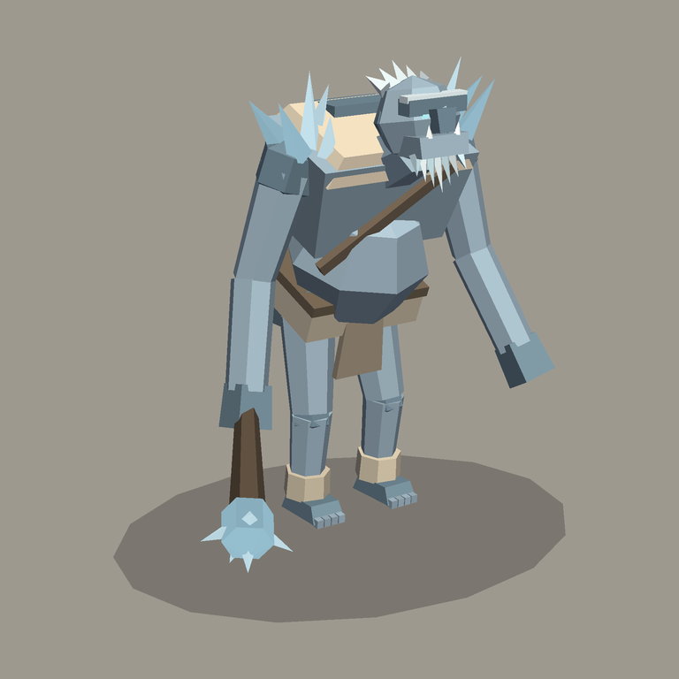

*4.3 m frost giant: frost-blue skin, glowing ice crystal clusters on both shoulders, icicle beard, swept frost hair, fur pelt and boots, ice-headed club.*

| | |
|---|---|
| Concept image | `images/giant_ice.png` |
| Reference code | `code/monsters/defs/giants.py` -> `build_giant_ice()` |
| Size class / anim profile | large / `giant` |
| Dimensions (W x L x H) | 3.83 x 2.35 x 4.14 m (design height 4.3 m = 2.39x player) |
| Triangles | **1020** (budget 800-1500 (hard max 2000)) |
| Joints | 18 (unlit/emissive: `eyes`, `ice_spikes`, `ice_club`) |

**Silhouette.** Hill-giant body (1.08x) topped with jagged ice spikes on the shoulders and a pointed icicle beard - the spikes make it read as 'ice' even as a dark silhouette. Club held low and forward (the hill giant raises its club, so the two variants don't share a pose).

**Body parts.** Same `_giant()` rig with `ice=True`: fur boot wraps, fur shoulder pelt, 7 icicle beard cones on `jaw`, frost brow + 5 swept hair cones, unlit `eyes` (pale cyan), unlit `ice_spikes` joint (2 x 5 crystal cones), unlit `ice_club` joint on `r_hand` (ice ball + 5 shards).

**Node hierarchy** (joint name @ position relative to parent, metres):

```text
root
  hips  @(0.00, 0.00, 1.86)
    l_leg  @(-0.32, 0.00, -0.11)
      l_shin  @(0.00, 0.04, -0.86)
    r_leg  @(0.32, 0.00, -0.11)
      r_shin  @(0.00, 0.04, -0.86)
    torso  @(0.00, 0.00, 0.13)
      head  @(0.00, 0.54, 1.71)
        jaw  @(0.00, 0.11, 0.09)
        eyes  @(0.00, 0.33, 0.29)
      l_arm  @(-0.84, 0.00, 1.32)
        l_forearm  @(0.00, 0.00, -0.99)
          l_hand  @(0.00, 0.02, -1.06)
      r_arm  @(0.84, 0.00, 1.32)
        r_forearm  @(0.00, 0.00, -0.99)
          r_hand  @(0.00, 0.02, -1.06)
            ice_club  @(0.00, 0.00, 1.35)
      ice_spikes  @(0.00, 0.00, 1.51)
```

**Palette**

| role | hex |
|---|---|
| skin | `#8ea5b4` |
| skin_dark | `#667e8d` |
| hair | `#d4e4ea` |
| cloth | `#c8bea8` |
| cloth_dark | `#8f8574` |
| rope | `#6b5f4f` |
| wood | `#4f4438` |
| wood_dark | `#3a3129` |
| eye | `#a8e6f2` |
| tooth | `#e4ecee` |
| ice | `#bcd9e4` |
| ice_dark | `#8fb6c6` |

**Animation.** `giant` profile, same timings as the hill giant. On the smash impact frame spawn a ring of frost shards and apply the freeze. death: topple forward; optionally shrink `ice_spikes` to 0 with LerpScaleInterval as the glow 'dies'.

**Combat (suggested)**

| Level | HP | Attack style | Max hit | Attack speed | Weakness | Aggressive |
|---|---|---|---|---|---|---|
| 61 | 105 | melee (crush) + frost | 13 | 3.0 s | fire spells / crush | yes |

Notes: Hits can freeze the player for 2 ticks; immune to water spells. Immune to water spells, weak to fire - the obvious counterpart to the hill giant.


### Wolves

#### 4.14 Grey Wolf (`wolf_grey`)

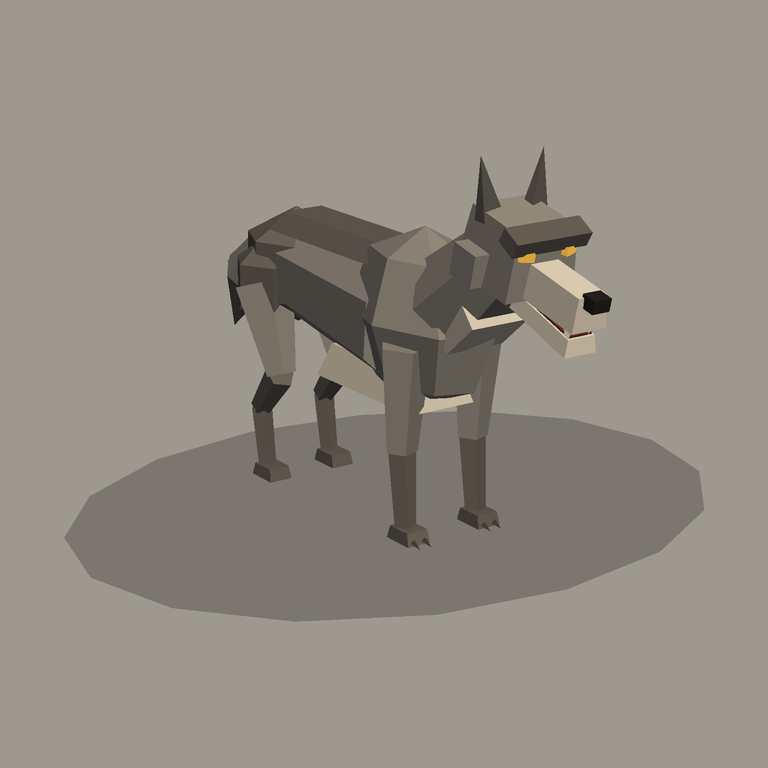

*Lean grey wolf, 0.9 m at the shoulder: deep chest, tucked waist, pale muzzle and belly, amber eyes, bushy drooping tail.*

| | |
|---|---|
| Concept image | `images/wolf_grey.png` |
| Reference code | `code/monsters/defs/wolves.py` -> `build_wolf_grey()` |
| Size class / anim profile | medium / `wolf` |
| Dimensions (W x L x H) | 0.42 x 1.91 x 1.25 m (design height 0.9 m = 0.50x player) |
| Triangles | **588** (budget 500-1000 (hard max 1200)) |
| Joints | 15 (unlit/emissive: `eyes`) |

**Silhouette.** Horizontal and leggy: deep chest tapering to a narrow waist, head carried forward at shoulder height, tall pointed ears, digitigrade hind legs with a visible hock.

**Body parts.** body (narrow chest ellipsoid, tapered waist tube, hip sphere, belly strip, dark saddle) -> `neck_0` (tube + throat ruff) -> head (skull box, muzzle box, nose, brow, ears, cheek ruffs, fangs) -> unlit `eyes`, `jaw`; front legs (upper tube -> shin + paw + claws), hind legs (thigh -> shin with hock: 2 tubes + paw); `tail` joint (2 tapered tubes, drooping 42 deg).

**Node hierarchy** (joint name @ position relative to parent, metres):

```text
root
  body  @(0.00, 0.00, 0.62)
    neck_0  @(0.00, 0.44, 0.10)
      head  @(0.00, 0.24, 0.20)
        eyes  @(0.00, 0.16, 0.07)
        jaw  @(0.00, 0.10, -0.07)
    l_front_leg  @(-0.13, 0.36, -0.08)
      l_front_shin  @(0.00, -0.02, -0.28)
    l_hind_leg  @(-0.12, -0.44, -0.02)
      l_hind_shin  @(0.00, 0.10, -0.28)
    r_front_leg  @(0.13, 0.36, -0.08)
      r_front_shin  @(0.00, -0.02, -0.28)
    r_hind_leg  @(0.12, -0.44, -0.02)
      r_hind_shin  @(0.00, 0.10, -0.28)
    tail  @(0.00, -0.56, 0.10)
```

**Palette**

| role | hex |
|---|---|
| fur | `#7c776e` |
| fur_dark | `#57524b` |
| belly | `#b3aa98` |
| muzzle | `#c1b8a5` |
| nose | `#1f1c1a` |
| eye | `#d9a53a` |
| mouth | `#5a2a26` |
| tooth | `#e0d8c0` |
| claw | `#3a342e` |

**Animation.** `wolf` profile. idle: breathing, head scanning +-12 deg, tail wag 0.8 s. walk (trot): quadruped diagonal gait at 1.6x speed (~0.6 s cycle) + body bob. attack: crouch 0.18 s, lunge the body joint forward 0.35 x height with front legs reaching, jaw snap, recover 0.25 s. death: fast fall onto its side (0.45 s).

**Combat (suggested)**

| Level | HP | Attack style | Max hit | Attack speed | Weakness | Aggressive |
|---|---|---|---|---|---|---|
| 18 | 26 | melee (stab) | 4 | 1.8 s | slash / ranged | yes |

Notes: Packs of 3-4; flees at 20% HP unless the pack leader is alive. Pack animal: spawn 3-4 together; cheap enough (588 tris) for packs.

#### 4.15 Dire Wolf (`wolf_dire`)

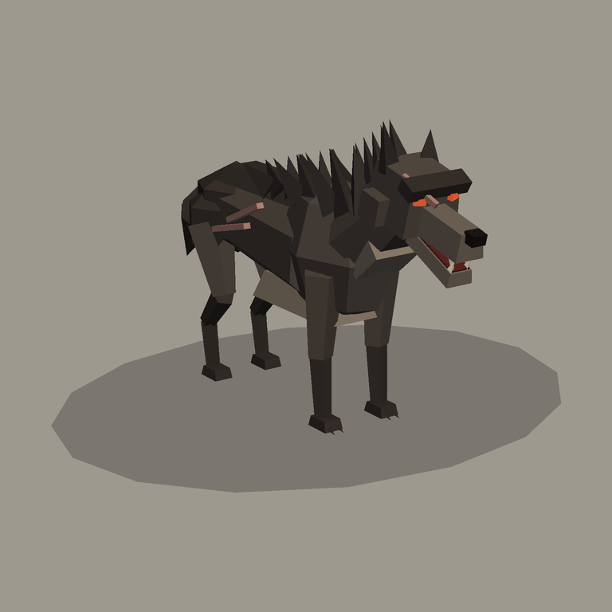

*Bigger (1.35x, ~1.2 m at the shoulder), near-black wolf with a bristling spiked mane, pale scars across its muzzle and flank, a torn ear, red eyes and oversized fangs.*

| | |
|---|---|
| Concept image | `images/wolf_dire.png` |
| Reference code | `code/monsters/defs/wolves.py` -> `build_wolf_dire()` |
| Size class / anim profile | large / `wolf` |
| Dimensions (W x L x H) | 0.57 x 2.58 x 1.68 m (design height 1.2 m = 0.67x player) |
| Triangles | **716** (budget 800-1500 (hard max 2000)) |
| Joints | 15 (unlit/emissive: `eyes`) |

**Silhouette.** Grey-wolf outline plus a ridge of dark spikes from the head down the neck and shoulders - reads as 'dire' at thumbnail size; jaw hangs open showing fangs.

**Body parts.** Same `_wolf()` rig with s=1.35, dire=True: 18 mane cones on the body + 5 on the neck, 2 flank scar strips + 1 muzzle scar, left ear shortened (torn), bigger fangs, jaw open -12 deg at rest, unlit red `eyes`.

**Node hierarchy** (joint name @ position relative to parent, metres):

```text
root
  body  @(0.00, 0.00, 0.84)
    neck_0  @(0.00, 0.59, 0.14)
      head  @(0.00, 0.32, 0.27)
        eyes  @(0.00, 0.22, 0.09)
        jaw  @(0.00, 0.14, -0.09)
    l_front_leg  @(-0.18, 0.49, -0.11)
      l_front_shin  @(0.00, -0.03, -0.38)
    l_hind_leg  @(-0.16, -0.59, -0.03)
      l_hind_shin  @(0.00, 0.14, -0.38)
    r_front_leg  @(0.18, 0.49, -0.11)
      r_front_shin  @(0.00, -0.03, -0.38)
    r_hind_leg  @(0.16, -0.59, -0.03)
      r_hind_shin  @(0.00, 0.14, -0.38)
    tail  @(0.00, -0.76, 0.14)
```

**Palette**

| role | hex |
|---|---|
| fur | `#433d38` |
| fur_dark | `#2c2825` |
| belly | `#6f665b` |
| muzzle | `#5e564d` |
| nose | `#151312` |
| eye | `#d5552c` |
| mouth | `#4a1e1b` |
| tooth | `#e2d9bf` |
| claw | `#2a2521` |
| mane | `#2e2a27` |
| scar | `#8e6a60` |

**Animation.** `wolf` profile at ~0.85 speed (heavier). Add a howl special: neck_0 pitch +35, head +20, jaw -35 for 1.2 s (buffs the pack).

**Combat (suggested)**

| Level | HP | Attack style | Max hit | Attack speed | Weakness | Aggressive |
|---|---|---|---|---|---|---|
| 49 | 72 | melee (stab) + bleed | 10 | 1.8 s | slash / fire | yes |

Notes: Howl buffs nearby wolves +10% accuracy; bite causes bleed (1 dmg/2 ticks x5). Pack leader: spawn one dire wolf with 2-3 grey wolves.


### New: Bog Lurker

#### 4.16 Bog Lurker (`bog_lurker`)

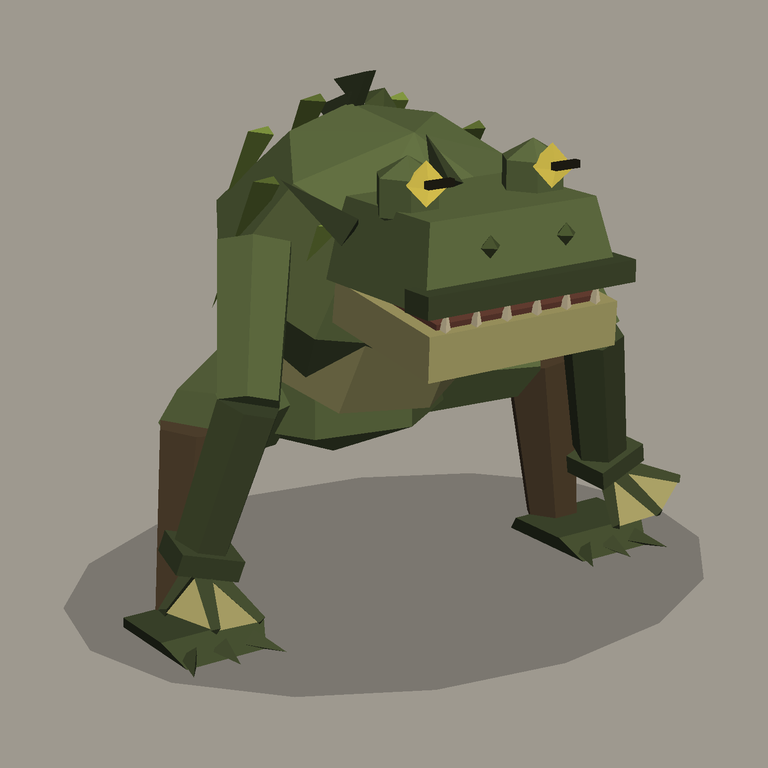

*Swamp ambusher: squat toad-troll with a huge flat head, wide jaw, bulging yellow eyes, back fin, warts and dripping weed.*

| | |
|---|---|
| Concept image | `images/bog_lurker.png` |
| Reference code | `code/monsters/defs/bog_lurker.py` -> `build_bog_lurker()` |
| Size class / anim profile | medium / `biped` |
| Dimensions (W x L x H) | 1.75 x 1.23 x 1.45 m (design height 1.5 m = 0.83x player) |
| Triangles | **722** (budget 500-1000 (hard max 1200)) |
| Joints | 15 (unlit/emissive: `eyes`) |

**Silhouette.** Very wide and low: frog-crouch legs splayed sideways, huge flat head, long arms with webbed hands. Wider than it is tall.

**Body parts.** hips sphere -> frog legs (thigh splays out and up, shin down to webbed foot with 3 toes); torso (pear ellipsoid + belly + back fin prisms + warts) leaning -30 deg -> `weed` strands, head (flat box, lip ridge, eye bulges, gill spikes) -> unlit `eyes`, `jaw` (belly-coloured, mouth plate, teeth); arms -> forearms with webbed hands (double-sided polygons).

**Node hierarchy** (joint name @ position relative to parent, metres):

```text
root
  hips  @(0.00, 0.00, 0.55)
    l_leg  @(-0.28, 0.00, -0.05)
      l_shin  @(-0.30, 0.22, 0.02)
    r_leg  @(0.28, 0.00, -0.05)
      r_shin  @(0.30, 0.22, 0.02)
    torso  @(0.00, 0.05, 0.12)
      weed  @(0.00, 0.00, 0.55)
      head  @(0.00, 0.28, 0.52)
        eyes  @(0.00, 0.18, 0.22)
        jaw  @(0.00, -0.05, -0.05)
      l_arm  @(-0.44, 0.05, 0.42)
        l_forearm  @(0.00, 0.00, -0.42)
      r_arm  @(0.44, 0.05, 0.42)
        r_forearm  @(0.00, 0.00, -0.42)
```

**Palette**

| role | hex |
|---|---|
| skin | `#4f5c39` |
| skin_dark | `#38412a` |
| belly | `#8e8a5b` |
| wart | `#3f4a2c` |
| weed | `#667a36` |
| weed_dark | `#4b5a2a` |
| eye | `#cdb84a` |
| pupil | `#1c1a12` |
| mouth | `#5c3a30` |
| mud | `#4a3d2c` |
| tooth | `#cfc5a2` |

**Animation.** idle: throat/torso breathing, jaw slowly opens/closes. walk: hop-waddle - legs +-18 deg with body bob 0.05 m on each step. attack: jaw opens -30 deg, lunge; 'tongue pull' = a thin pink box scaling out from jaw (LerpScaleInterval). death: fall_over, or sink into the water plane (LerpPosInterval z -1.0).

**Combat (suggested)**

| Level | HP | Attack style | Max hit | Attack speed | Weakness | Aggressive |
|---|---|---|---|---|---|---|
| 45 | 60 | melee (crush) + tongue pull | 9 | 2.4 s | fire spells / slash | yes |

Notes: Hides submerged (only eyes visible) until the player is within 2 tiles. Submerged ambush: only the `eyes` joint above the water surface until triggered.


### New: Stone Golem

#### 4.17 Stone Golem (`stone_golem`)

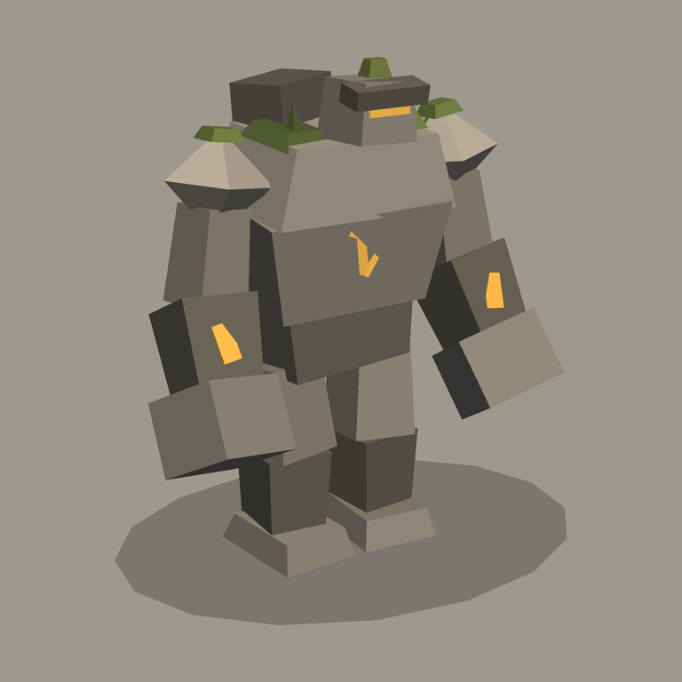

*2.6 m animated barrow-stone guardian: stacked, slightly skewed boulders, moss and grass on the shoulders, amber rune-light in the chest and eye slit.*

| | |
|---|---|
| Concept image | `images/stone_golem.png` |
| Reference code | `code/monsters/defs/stone_golem.py` -> `build_stone_golem()` |
| Size class / anim profile | large / `biped` |
| Dimensions (W x L x H) | 2.19 x 0.97 x 2.46 m (design height 2.6 m = 1.44x player) |
| Triangles | **380** (budget 800-1500 (hard max 2000)) |
| Joints | 14 (unlit/emissive: `rune`, `eyes`) |

**Silhouette.** Blocky and massive: shoulders wider than everything, tiny head, huge boulder fists. Boxes intentionally rotated a few degrees each so it looks hewn, not machined.

**Body parts.** hips slab -> legs (skewed thigh box, shin box, foot slab); torso (lower + upper boulders, back rock, moss slabs, grass cones) -> unlit `rune`, head (box, brow slab, moss) -> unlit `eyes`; arms (2x5 low sphere shoulder boulder, upper arm box, forearm box, fist boulder, rune glyph).

**Node hierarchy** (joint name @ position relative to parent, metres):

```text
root
  hips  @(0.00, 0.00, 1.05)
    l_leg  @(-0.26, 0.00, -0.12)
      l_shin  @(0.00, 0.00, -0.46)
    r_leg  @(0.26, 0.00, -0.12)
      r_shin  @(0.00, 0.00, -0.46)
    torso  @(0.00, 0.00, 0.16)
      rune  @(0.02, 0.29, 0.36)
      head  @(0.00, 0.20, 0.90)
        eyes  @(0.00, 0.20, 0.11)
      l_arm  @(-0.66, 0.00, 0.66)
        l_forearm  @(0.00, 0.00, -0.58)
      r_arm  @(0.66, 0.00, 0.66)
        r_forearm  @(0.00, 0.00, -0.58)
```

**Palette**

| role | hex |
|---|---|
| stone | `#7b776c` |
| stone_dark | `#5b584f` |
| stone_light | `#958f82` |
| moss | `#5f6d3a` |
| moss_dark | `#4a5630` |
| rune | `#e0a542` |

**Animation.** biped profile at half speed (walk cycle 1.8 s), no arm counter-swing (arms swing +-8 only). attack: overhead double-fist smash. death: fall_over then (optional) split into pieces - reparent each limb to render and give it a small LerpPos/Hpr outward. Rune light can pulse via colour-scale LerpFunc.

**Combat (suggested)**

| Level | HP | Attack style | Max hit | Attack speed | Weakness | Aggressive |
|---|---|---|---|---|---|---|
| 70 | 120 | melee (crush) | 15 | 3.6 s | crush (pickaxes deal +20%) / water spells | no |

Notes: Very slow. Takes 50% less from stab and slash. Cheapest model in the pack (380 tris) - great for distant placement.


### New: Barrow Wraith

#### 4.18 Barrow Wraith (`barrow_wraith`)

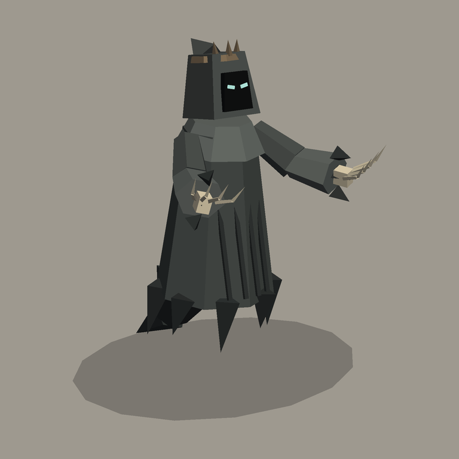

*Legless floating spirit in a tattered grey burial cloak with a rusted circlet crown, void-black face with pale eyes, long skeletal claws.*

| | |
|---|---|
| Concept image | `images/barrow_wraith.png` |
| Reference code | `code/monsters/defs/barrow_wraith.py` -> `build_barrow_wraith()` |
| Size class / anim profile | medium / `floater` |
| Dimensions (W x L x H) | 1.44 x 1.86 x 2.29 m (design height 2.1 m = 1.17x player) |
| Triangles | **510** (budget 500-1000 (hard max 1200)) |
| Joints | 12 (unlit/emissive: `eyes`) |

**Silhouette.** Tall tapering cloak column ending in ragged points with a trailing tail, hood with crown spikes, arms reaching forward.

**Body parts.** body (cloak tube, mantle, hem tatters, fold strips) -> tail_0 -> tail_1 (trailing wisp); head (hood box + peak, void face panel, circlet + 3 spikes) -> unlit `eyes`; arms (sleeve tube -> flared forearm with tatters -> bone hand with 4 clawed fingers).

**Node hierarchy** (joint name @ position relative to parent, metres):

```text
root
  body  @(0.00, 0.00, 1.10)
    tail_0  @(0.00, -0.25, -0.45)
      tail_1  @(0.00, -0.50, -0.25)
    head  @(0.00, 0.04, 0.66)
      eyes  @(0.00, 0.19, 0.17)
    l_arm  @(-0.26, 0.02, 0.50)
      l_forearm  @(0.00, 0.00, -0.34)
        l_hand  @(0.00, 0.00, -0.32)
    r_arm  @(0.26, 0.02, 0.50)
      r_forearm  @(0.00, 0.00, -0.34)
        r_hand  @(0.00, 0.00, -0.32)
```

**Palette**

| role | hex |
|---|---|
| cloak | `#3d4241` |
| cloak_dark | `#272b2b` |
| cloak_light | `#535957` |
| bone | `#bdb59c` |
| void | `#0e0f10` |
| eye | `#a9dcd2` |
| iron | `#6b5d4a` |

**Animation.** floater profile: bob +-0.08 m, tail sways, arms drift. attack: both arms up (+60 pitch) then rake. death: floater_death (spin + shrink); optionally fade with LerpColorScaleInterval alpha -> 0 (set TransparencyAttrib first).

**Combat (suggested)**

| Level | HP | Attack style | Max hit | Attack speed | Weakness | Aggressive |
|---|---|---|---|---|---|---|
| 58 | 70 | magic (soul drain) / melee (claws) | 11 | 2.4 s | holy / silver weapons; immune to poison | yes |

Notes: Soul drain heals it for 50% of damage. Only appears at night in barrows. Night-only barrow spawn; a good 'first magic-user enemy' for mid levels.


### New: Cave Gnasher

#### 4.19 Cave Gnasher (`cave_gnasher`)

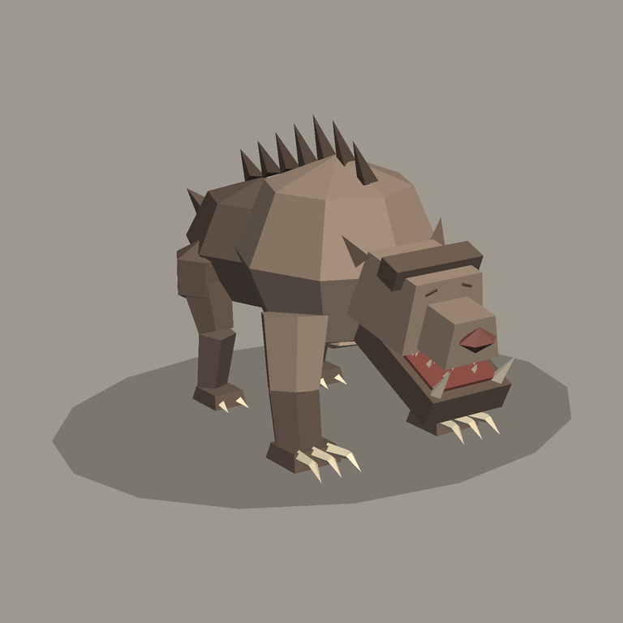

*Blind burrowing beast of the deep mines: front-heavy mole/badger/bear, eyeless heavy skull with a huge underbite and tusks, massive digging claws.*

| | |
|---|---|
| Concept image | `images/cave_gnasher.png` |
| Reference code | `code/monsters/defs/cave_gnasher.py` -> `build_cave_gnasher()` |
| Size class / anim profile | large / `quadruped` |
| Dimensions (W x L x H) | 1.07 x 2.46 x 1.49 m (design height 1.25 m = 0.69x player) |
| Triangles | **690** (budget 800-1500 (hard max 2000)) |
| Joints | 13 (unlit/emissive: none) |

**Silhouette.** Hump at the shoulders with a bristle ridge, head carried low, thick front legs with long claws; tapering rear.

**Body parts.** body (chest hump + hindquarters + belly ellipsoids, 7 bristle cones) -> tail; head (skull box, snout box, nose, brow with scars instead of eyes, ears, upper teeth) -> `jaw` (underbite, tusks, teeth); 4 legs using the quadruped names (`l_front_leg`/`l_front_shin`, `l_hind_leg`/`l_hind_shin`, ...).

**Node hierarchy** (joint name @ position relative to parent, metres):

```text
root
  body  @(0.00, 0.00, 0.78)
    tail  @(0.00, -0.86, 0.00)
    head  @(0.00, 0.68, 0.02)
      jaw  @(0.00, 0.05, -0.12)
    l_front_leg  @(-0.36, 0.38, -0.12)
      l_front_shin  @(0.00, 0.06, -0.34)
    l_hind_leg  @(-0.30, -0.50, -0.14)
      l_hind_shin  @(0.00, 0.10, -0.28)
    r_front_leg  @(0.36, 0.38, -0.12)
      r_front_shin  @(0.00, 0.06, -0.34)
    r_hind_leg  @(0.30, -0.50, -0.14)
      r_hind_shin  @(0.00, 0.10, -0.28)
```

**Palette**

| role | hex |
|---|---|
| hide | `#8a7a6c` |
| hide_dark | `#5f5249` |
| belly | `#a69482` |
| fur | `#4a3f38` |
| claw | `#d7ccb0` |
| gum | `#7a4640` |
| tooth | `#e0d6bc` |
| nose | `#6e4a44` |

**Animation.** quadruped profile. idle: nose sniffing (head heading +-8, fast 0.6 s). walk: 1.0 s diagonal gait. attack: bite lunge. special: burrow - LerpPosInterval root z -1.3 over 0.8 s with dust particles, reappear at target.

**Combat (suggested)**

| Level | HP | Attack style | Max hit | Attack speed | Weakness | Aggressive |
|---|---|---|---|---|---|---|
| 64 | 95 | melee (crush/stab) | 13 | 2.4 s | slash / fire; stunned by light sources | yes |

Notes: Burrows and re-emerges under the player (telegraphed by dust). Stunned by light - pairs well with a lantern mechanic.


### New: Rot Ghoul

#### 4.20 Rot Ghoul (`rot_ghoul`)

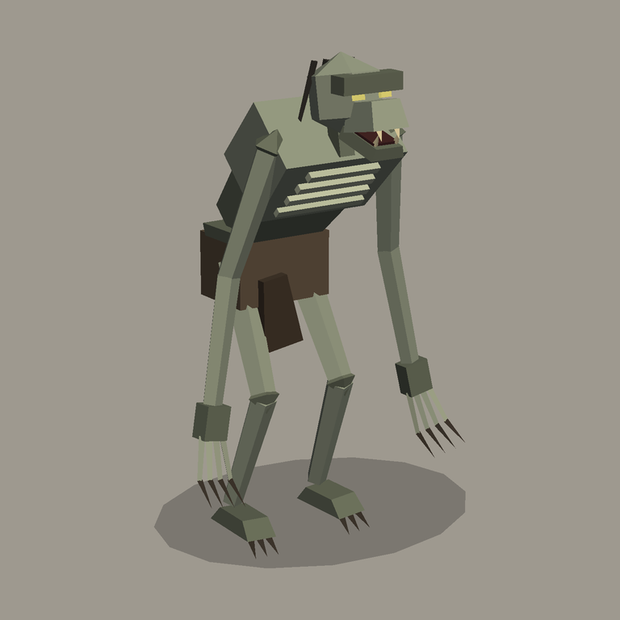

*Gaunt, hunched graveyard scavenger with grey-green skin, visible ribs and spine knobs, hanging jaw, sickly yellow eyes and black claws.*

| | |
|---|---|
| Concept image | `images/rot_ghoul.png` |
| Reference code | `code/monsters/defs/rot_ghoul.py` -> `build_rot_ghoul()` |
| Size class / anim profile | medium / `biped` |
| Dimensions (W x L x H) | 0.92 x 0.73 x 1.52 m (design height 1.45 m = 0.81x player) |
| Triangles | **648** (budget 500-1000 (hard max 1200)) |
| Joints | 14 (unlit/emissive: `eyes`) |

**Silhouette.** Lanky 'question mark': torso bent 45 deg forward, head pushed out, arms longer than legs reaching almost to the ground, digitigrade bent legs.

**Body parts.** hips (pelvis + loincloth) -> bent legs with knee knobs and clawed feet; torso (tapered boxes, 4 rib bars, 6 spine knobs) -> head (gaunt skull, brow, snout, hair strands) -> unlit `eyes`, `jaw` (hangs open 25 deg); long arms -> forearm -> 4 long fingers with dark claw cones.

**Node hierarchy** (joint name @ position relative to parent, metres):

```text
root
  hips  @(0.00, 0.00, 0.78)
    l_leg  @(-0.11, 0.00, -0.04)
      l_shin  @(0.00, 0.00, -0.42)
    r_leg  @(0.11, 0.00, -0.04)
      r_shin  @(0.00, 0.00, -0.42)
    torso  @(0.00, 0.00, 0.06)
      head  @(0.00, 0.06, 0.52)
        eyes  @(0.00, 0.14, 0.12)
        jaw  @(0.00, 0.06, 0.04)
      l_arm  @(-0.20, 0.02, 0.46)
        l_forearm  @(0.00, 0.00, -0.40)
      r_arm  @(0.20, 0.02, 0.46)
        r_forearm  @(0.00, 0.00, -0.40)
```

**Palette**

| role | hex |
|---|---|
| skin | `#7d8472` |
| skin_dark | `#585e4f` |
| rib | `#9ca28b` |
| cloth | `#4d4235` |
| cloth_dark | `#382f25` |
| claw | `#2f2a24` |
| eye | `#d0c56a` |
| mouth | `#3a2020` |
| tooth | `#b9ae8a` |
| hair | `#2e2c28` |

**Animation.** biped profile with twitchy timing: idle head jerks (use 0.15 s snaps between random rest+delta poses). walk: 0.8 s, legs +-25, arms drag +-10. attack: two-hand rake (both arms). death: fall_over.

**Combat (suggested)**

| Level | HP | Attack style | Max hit | Attack speed | Weakness | Aggressive |
|---|---|---|---|---|---|---|
| 33 | 44 | melee (slash) + disease | 7 | 1.8 s | fire / holy; crush | yes |

Notes: Disease: drains 1 Strength per hit until cured. Feeds on corpses to heal. Disease mechanic; eats corpses to heal (play attack anim on a corpse).


---

## 5. Implementation order (step by step)

Do these in order; each step ends with a check. Commit after each green step.

1. **Survey the repo.** Find: how Panda3D is started (`ShowBase` subclass?), existing entity/NPC classes,
   combat/damage code, asset folders, how pygame is used, Python + Panda3D versions
   (`python -c "import panda3d; print(panda3d.__version__)"` - needs 1.10.x). Write a short plan of where
   `monsters/` will live and what it will hook into. Do not change unrelated code.
2. **Add `monsters/mesh_builder.py` + `monsters/lighting.py`** (copy 8.1 / 8.2 verbatim).
   Check: `python -c "from monsters.mesh_builder import MeshBuilder; m=MeshBuilder(); m.box(); print(m.triangle_count)"` prints `12`.
3. **Add `registry.py`, `defs/__init__.py`, `defs/parts.py`, and ONE monster: `defs/goblins.py`.**
   Temporarily set `DEF_MODULES = ["goblins"]` in `registry.py`.
4. **Add `tools/monster_viewer.py`** and run `python tools/monster_viewer.py goblin_grunt`.
   Check against `images/goblin_grunt.png`: flat facets visible, colours muted, ears/nose/club read
   clearly, stands on the ground (feet at z ~ 0), ~1.2 m tall next to the 1.8 m post, ~544 tris in the HUD.
   If the machine is headless: `python tools/monster_viewer.py goblin_grunt --screenshot shot.png`.
5. **Add `animations.py` + `base.py`.** In the viewer press 1-4 (idle/walk/attack/death) and R (respawn).
   Check: loops are smooth, attack returns to idle, death falls and hides, respawn restores.
   Headless: `python tools/anim_test.py --only goblin_grunt`.
6. **Wire one goblin into the real game**: spawn via `registry.create(...)` wherever the game spawns
   NPCs/monsters, map the game's move/attack/die events to `play("walk"/"attack"/"death")`, and apply the
   player-scale factor from 1.2 if needed. Apply `setup_osrs_lighting()` to the game's render (or align
   the existing lights with it). Check in-game at normal camera distance: readable silhouette, no z-fighting.
7. **Add the remaining families** one file at a time, extending `DEF_MODULES`:
   goblin shaman -> skeletons -> spiders -> dragons -> void -> giants -> wolves -> bog lurker -> stone golem ->
   barrow wraith -> cave gnasher -> rot ghoul. After each: open in the viewer, compare to its concept image and the
   section-4 spec (triangles within budget, joints named as specified, emissive joints unlit).
8. **Run the full smoke test**: `python tools/anim_test.py` -> must end with `all animations OK`.
9. **UI integration**: `python tools/render_icons.py --out assets/ui/monster_icons` and use the icons in
   the pygame/DirectGUI UI (target panel, bestiary). If the world is pygame-2D, generate sprite sheets
   with `tools/render_sprites.py` instead and integrate those.
10. **Gameplay data**: merge the section-4 stats into the game's existing monster data (don't create a
    parallel stats system if one exists). Add special mechanics later as separate tasks (dragonfire,
    shaman heal, broodmother hatchlings, bog-lurker ambush, gnasher burrow, wraith soul drain).
11. **Performance pass** (section 7) once many monsters are on screen.

---

## 6. Verification checklist

- [ ] `python -m py_compile monsters/*.py monsters/defs/*.py tools/*.py` passes.
- [ ] `python tools/anim_test.py` prints one `OK` line per monster and `all animations OK`.
- [ ] Every monster within its triangle budget (1.3).
- [ ] Facets are visibly flat under the sun light; no smooth gradients (if smooth -> see 7).
- [ ] No textures loaded for procedural monsters; colours match the section-4 hex tables.
- [ ] Emissive joints are unlit (eyes/runes/crystals keep full brightness on the shadow side).
- [ ] Feet on the ground (z ~ 0) in rest pose; floaters hover with their shadow separated.
- [ ] Heights match 1.2 relative to the player.
- [ ] Silhouette test: render icons at 48-64 px - every monster still identifiable.
- [ ] Death -> respawn cycle leaves no leftover rotation/scale.
- [ ] No second window opened by pygame when Panda3D is running.

---

## 7. Performance and troubleshooting

**Performance**
- Build each monster type's geometry once and copy it for more spawns: `rig.root.copy_to(parent)` gives
  a deep copy with the same joint names (look the joints up with `find("**/l_leg")`) - or simply call the
  builder again; builders take ~5 ms each (measured), so cache per type if spawning in bulk.
- Each joint is a separate Geom (12-20 draw calls per monster). For far-away monsters that don't animate,
  `np.flatten_strong()` on a copy merges them into ~1 geom. For crowds, a 2-level LOD
  (`LODNode`: full rig near, flattened copy or sprite far) keeps draw calls low.
- Stop intervals of monsters out of view (`monster._ival.pause()`), restart when visible.

**Troubleshooting**

| Symptom | Cause / fix |
|---|---|
| Model looks smooth / soft | `set_shader_auto()` is on somewhere -> `render.set_shader_off()`; or glTF exported with smooth normals -> Shade Flat. |
| Everything black | No lights on the node -> call `setup_osrs_lighting(render)`; or a `Material` with black diffuse -> `set_material_off(1)`. |
| Colours washed / white | Material overriding vertex colours (glTF) -> `model.set_material_off(1)`; or `set_color()` on a parent overriding vertex colour -> use `set_color_scale()` for tints/flashes instead. |
| Faces missing / see-through | Custom `tri()` without `outward_from` wound inward -> pass the primitive centre or `double_sided=True` for thin parts. |
| Flickering detail | Two coplanar faces (z-fighting) -> offset the detail 5-10 mm outward. |
| Limb rotates around the wrong point | Geometry built in parent space instead of joint space -> model from the joint origin. |
| Weapon points the wrong way | Use `aim(rig, "r_hand", (x, y, z))` with a root-space direction instead of hand-tuned hpr. |
| Animation drifts over time | Lerps must use explicit start values relative to `m.rest` (as in `animations.py`), never "current". |
| Glow parts dark | `set_light_off()` must be called *after* `rig.bake()` on the glow joint. |
| `No graphics pipe is available` (CI/headless) | Use `window-type offscreen`; on Linux servers needs an X display (Xvfb) or EGL (`load-display p3headlessgl`). |

Hit-flash: `monster.node.set_color_scale(1.6, 1.6, 1.6, 1)` for 0.1 s then `clear_color_scale()`
(works with vertex colours; `set_color` would replace them).

---

## 8. Appendix: full reference listings

These are the exact files from `code/monsters/` (also in the pack). They compile and were tested on
Panda3D 1.10.15. The remaining def files (`dragons.py`, `skeletons.py`, `spiders.py`, `void.py`, `giants.py`, `wolves.py`,
`bog_lurker.py`, `stone_golem.py`, `barrow_wraith.py`, `cave_gnasher.py`, `rot_ghoul.py`) plus
`portraits.py` and the tools are in the pack - copy them as files rather than retyping.

### 8.1 `monsters/mesh_builder.py`

```python
"""
monsters/mesh_builder.py
------------------------
Tiny procedural low-poly mesh toolkit for Panda3D 1.10.x (OSRS-style art).

* Every triangle gets its OWN three vertices (no sharing) so each face has a
  single flat normal and a single colour -> crisp faceted "flat shading" even
  with Panda3D's default fixed-function (per-vertex) lighting.
* Colours are per face (vertex colours), no textures needed.
* A small deterministic brightness jitter per face gives the hand-painted,
  slightly uneven look of early-2000s MMO models (set jitter=0 to disable).
* Primitives are convex and are auto-oriented so faces always point outward,
  so you never have to think about winding order.

Coordinate convention (Panda3D default): +X right, +Y forward, +Z up.
1 unit = 1 metre. Monsters face +Y.
"""
from __future__ import annotations

import math
import random
import zlib
from typing import Iterable, Sequence

from panda3d.core import (
    Geom,
    GeomNode,
    GeomTriangles,
    GeomVertexData,
    GeomVertexFormat,
    GeomVertexWriter,
    LColor,
    Mat4,
    NodePath,
    Point3,
    TransformState,
    Vec3,
)

ColorLike = "str | Sequence[float]"


# --------------------------------------------------------------------------
# colour helpers
# --------------------------------------------------------------------------
def hex_to_rgba(value, alpha: float = 1.0) -> LColor:
    """'#6b8e23' / '6b8e23' / (r,g,b[,a]) floats 0-1 -> LColor."""
    if isinstance(value, LColor):
        return LColor(value)
    if isinstance(value, str):
        h = value.lstrip("#")
        r, g, b = (int(h[i:i + 2], 16) / 255.0 for i in (0, 2, 4))
        return LColor(r, g, b, alpha)
    vals = list(value)
    if len(vals) == 3:
        vals.append(alpha)
    return LColor(*vals)


def shade(color, factor: float) -> LColor:
    """Multiply rgb by factor (0.8 = 20% darker, 1.2 = lighter), clamped."""
    c = hex_to_rgba(color)
    return LColor(min(c[0] * factor, 1.0), min(c[1] * factor, 1.0),
                  min(c[2] * factor, 1.0), c[3])


def _mat(pos=(0, 0, 0), hpr=(0, 0, 0), scale=1.0) -> Mat4:
    if isinstance(scale, (int, float)):
        scale = (scale, scale, scale)
    return TransformState.make_pos_hpr_scale(
        Point3(*pos), Vec3(*hpr), Vec3(*scale)).get_mat()


def _basis(axis: Vec3):
    """Two unit vectors perpendicular to axis (and to each other)."""
    a = Vec3(axis)
    a.normalize()
    ref = Vec3(0, 0, 1) if abs(a.z) < 0.95 else Vec3(0, 1, 0)
    u = a.cross(ref)
    u.normalize()
    v = a.cross(u)
    v.normalize()
    return u, v


# --------------------------------------------------------------------------
# MeshBuilder
# --------------------------------------------------------------------------
class MeshBuilder:
    """Accumulates flat-coloured triangles, then bakes one Geom."""

    _FORMAT = GeomVertexFormat.get_v3n3c4()

    def __init__(self, name: str = "mesh", jitter: float = 0.05, seed: int = 1):
        self.name = name
        self.jitter = jitter
        self._rng = random.Random(seed)
        self._tris: list[tuple[Point3, Point3, Point3, LColor]] = []

    # ---- low level ---------------------------------------------------------
    @property
    def triangle_count(self) -> int:
        return len(self._tris)

    def _face_color(self, color) -> LColor:
        c = hex_to_rgba(color)
        if self.jitter:
            c = shade(c, 1.0 + self._rng.uniform(-self.jitter, self.jitter))
        return c

    def tri(self, a, b, c, color, outward_from=None, double_sided=False):
        """Add one triangle. If outward_from (a point) is given, the winding is
        flipped when needed so the face normal points away from that point."""
        a, b, c = Point3(*a), Point3(*b), Point3(*c)
        n = (b - a).cross(c - a)
        if n.length_squared() < 1e-12:
            return  # degenerate, skip
        if outward_from is not None:
            centre = (a + b + c) / 3.0
            if n.dot(centre - Point3(*outward_from)) < 0:
                b, c = c, b
        col = self._face_color(color)
        self._tris.append((a, b, c, col))
        if double_sided:
            self._tris.append((a, c, b, col))

    def quad(self, a, b, c, d, color, outward_from=None, double_sided=False):
        """Quad a-b-c-d (in order around the edge) -> 2 tris, same colour."""
        col = self._face_color(color)
        j, self.jitter = self.jitter, 0.0   # keep both halves identical
        self.tri(a, b, c, col, outward_from, double_sided)
        self.tri(a, c, d, col, outward_from, double_sided)
        self.jitter = j

    def polygon(self, points: Sequence, color, double_sided=True):
        """Flat convex-ish polygon as a fan (wing membranes, ears, fins)."""
        pts = [Point3(*p) for p in points]
        col = self._face_color(color)
        j, self.jitter = self.jitter, 0.0
        for i in range(1, len(pts) - 1):
            self.tri(pts[0], pts[i], pts[i + 1], col, double_sided=double_sided)
        self.jitter = j

    # ---- primitives --------------------------------------------------------
    def box(self, size=(1, 1, 1), color="#808080", pos=(0, 0, 0), hpr=(0, 0, 0),
            taper=(1.0, 1.0), top_offset=(0.0, 0.0)):
        """Box centred on pos. taper scales the TOP face (x, y) -> frustum /
        wedge shapes; top_offset shifts the top face (x, y) for slanted boxes."""
        sx, sy, sz = (s * 0.5 for s in size)
        tx, ty = sx * taper[0], sy * taper[1]
        ox, oy = top_offset
        m = _mat(pos, hpr)
        bottom = [(-sx, -sy, -sz), (sx, -sy, -sz), (sx, sy, -sz), (-sx, sy, -sz)]
        top = [(-tx + ox, -ty + oy, sz), (tx + ox, -ty + oy, sz),
               (tx + ox, ty + oy, sz), (-tx + ox, ty + oy, sz)]
        B = [m.xform_point(Point3(*p)) for p in bottom]
        T = [m.xform_point(Point3(*p)) for p in top]
        centre = sum(B + T, Point3(0, 0, 0)) / 8.0
        self.quad(*B, color, outward_from=centre)
        self.quad(*T, color, outward_from=centre)
        for i in range(4):
            k = (i + 1) % 4
            self.quad(B[i], B[k], T[k], T[i], color, outward_from=centre)
        return self

    def tube(self, start, end, r_start=0.1, r_end=None, color="#808080",
             segments=6, caps=True, twist=0.0, squash=1.0, double_sided=False):
        """Tapered cylinder between two points (limbs, necks, tails, horns).
        r_end=0 makes a cone. squash<1 flattens the cross-section."""
        if r_end is None:
            r_end = r_start
        s, e = Point3(*start), Point3(*end)
        axis = e - s
        if axis.length_squared() < 1e-12:
            return self
        u, v = _basis(axis)
        ring_s, ring_e = [], []
        for i in range(segments):
            ang = twist + 2 * math.pi * i / segments
            off = u * math.cos(ang) + v * (math.sin(ang) * squash)
            ring_s.append(s + off * r_start)
            ring_e.append(e + off * r_end)
        centre = (s + e) / 2.0
        for i in range(segments):
            k = (i + 1) % segments
            if r_end <= 1e-6:
                self.tri(ring_s[i], ring_s[k], e, color, outward_from=centre)
            elif r_start <= 1e-6:
                self.tri(s, ring_e[k], ring_e[i], color, outward_from=centre)
            else:
                self.quad(ring_s[i], ring_s[k], ring_e[k], ring_e[i], color,
                          outward_from=centre, double_sided=double_sided)
        if caps:
            if r_start > 1e-6:
                self._cap(ring_s, color, centre)
            if r_end > 1e-6:
                self._cap(ring_e, color, centre)
        return self

    def _cap(self, ring, color, centre):
        col = self._face_color(color)
        j, self.jitter = self.jitter, 0.0
        for i in range(1, len(ring) - 1):
            self.tri(ring[0], ring[i], ring[i + 1], col, outward_from=centre)
        self.jitter = j

    def cone(self, base, tip, radius=0.1, color="#808080", segments=5, twist=0.0,
             squash=1.0):
        """Cone (spikes, claws, teeth, horns, hats)."""
        return self.tube(base, tip, radius, 0.0, color, segments, twist=twist,
                         squash=squash)

    def sphere(self, radius=0.5, color="#808080", pos=(0, 0, 0), hpr=(0, 0, 0),
               scale=(1, 1, 1), rings=4, segments=6):
        """Low-poly UV sphere / ellipsoid (rings>=2). Great for heads, bellies,
        joints, eyes. rings=3, segments=5 is very chunky; 5x8 is 'smooth'."""
        m = _mat(pos, hpr, scale)
        grid = []
        for r in range(rings + 1):
            phi = math.pi * r / rings
            z = math.cos(phi) * radius
            rr = math.sin(phi) * radius
            row = []
            for s in range(segments):
                th = 2 * math.pi * s / segments
                row.append(m.xform_point(Point3(rr * math.cos(th), rr * math.sin(th), z)))
            grid.append(row)
        centre = m.xform_point(Point3(0, 0, 0))
        for r in range(rings):
            for s in range(segments):
                k = (s + 1) % segments
                a, b = grid[r][s], grid[r][k]
                c, d = grid[r + 1][k], grid[r + 1][s]
                if r == 0:
                    self.tri(a, c, d, color, outward_from=centre)
                elif r == rings - 1:
                    self.tri(a, b, c, color, outward_from=centre)
                else:
                    self.quad(a, b, c, d, color, outward_from=centre)
        return self

    def prism(self, points2d: Sequence, depth: float, color="#808080",
              pos=(0, 0, 0), hpr=(0, 0, 0)):
        """Extrude a convex 2D outline (in the XZ plane) along Y by depth.
        Good for blades, shields, axe heads, ears, teeth plates."""
        m = _mat(pos, hpr)
        h = depth / 2.0
        front = [m.xform_point(Point3(x, -h, z)) for x, z in points2d]
        back = [m.xform_point(Point3(x, h, z)) for x, z in points2d]
        centre = sum(front + back, Point3(0, 0, 0)) / (2 * len(front))
        self._cap(front, color, centre)
        self._cap(back, color, centre)
        n = len(front)
        for i in range(n):
            k = (i + 1) % n
            self.quad(front[i], front[k], back[k], back[i], color, outward_from=centre)
        return self

    # ---- output ------------------------------------------------------------
    def build_geom(self) -> Geom:
        vdata = GeomVertexData(self.name, self._FORMAT, Geom.UH_static)
        vdata.unclean_set_num_rows(len(self._tris) * 3)
        vw = GeomVertexWriter(vdata, "vertex")
        nw = GeomVertexWriter(vdata, "normal")
        cw = GeomVertexWriter(vdata, "color")
        prim = GeomTriangles(Geom.UH_static)
        for i, (a, b, c, col) in enumerate(self._tris):
            n = (b - a).cross(c - a)
            n.normalize()
            for p in (a, b, c):
                vw.set_data3(p)
                nw.set_data3(n)
                cw.set_data4(col)
            prim.add_vertices(i * 3, i * 3 + 1, i * 3 + 2)
        geom = Geom(vdata)
        geom.add_primitive(prim)
        return geom

    def build_node(self) -> NodePath:
        node = GeomNode(self.name)
        if self._tris:
            node.add_geom(self.build_geom())
        return NodePath(node)


# --------------------------------------------------------------------------
# Rig: joints (pivot NodePaths) + attached meshes
# --------------------------------------------------------------------------
class Rig:
    """Node hierarchy for a monster.

    Each joint is an empty NodePath placed at the pivot point (hip, shoulder,
    neck ...). Meshes are built in the joint's LOCAL space and attached, so
    rotating a joint (e.g. with LerpHprInterval) swings the whole limb and all
    of its children.

        rig = Rig("goblin")
        rig.joint("hips", pos=(0, 0, 0.55))
        rig.joint("l_leg", parent="hips", pos=(-0.12, 0, 0))
        rig.mesh("l_leg").tube((0, 0, 0), (0, 0, -0.5), 0.07, 0.05, "#556b2f")
        rig.bake()
    """

    def __init__(self, name: str, jitter: float = 0.05):
        self.root = NodePath(name)
        self.joints: dict[str, NodePath] = {"root": self.root}
        self.triangle_count = 0
        self.jitter = jitter
        self._meshes: dict[str, MeshBuilder] = {}

    def joint(self, name: str, parent: str = "root", pos=(0, 0, 0), hpr=(0, 0, 0)) -> NodePath:
        if name in self.joints:
            raise ValueError(f"joint {name!r} already exists")
        np = self.joints[parent].attach_new_node(name)
        np.set_pos(*pos)
        np.set_hpr(*hpr)
        self.joints[name] = np
        return np

    def attach(self, joint: str, mesh: MeshBuilder) -> NodePath:
        self.triangle_count += mesh.triangle_count
        geom_np = mesh.build_node()
        geom_np.reparent_to(self.joints[joint])
        return geom_np

    def mesh(self, joint: str) -> MeshBuilder:
        """MeshBuilder bound to a joint (created on first use). Call bake()
        once everything is modelled."""
        if joint not in self._meshes:
            if joint not in self.joints:
                raise KeyError(f"unknown joint {joint!r}")
            self._meshes[joint] = MeshBuilder(
                joint, jitter=self.jitter, seed=zlib.crc32(joint.encode()))
        return self._meshes[joint]

    def bake(self) -> "Rig":
        """Turn every pending MeshBuilder into geometry under its joint.
        Returns self so build functions can `return rig.bake()`."""
        for joint, mb in self._meshes.items():
            self.attach(joint, mb)
        self._meshes.clear()
        return self

    def __getitem__(self, name: str) -> NodePath:
        return self.joints[name]

    def rest_pose(self) -> dict[str, tuple]:
        """Snapshot of every joint's hpr - animations lerp relative to this."""
        return {n: tuple(np.get_hpr()) for n, np in self.joints.items()}


def mirror_x(points: Iterable) -> list:
    """Mirror a list of points across the YZ plane (left <-> right parts)."""
    return [(-p[0], p[1], p[2]) for p in points]
```

### 8.2 `monsters/lighting.py`

```python
"""monsters/lighting.py - OSRS-style lighting for Panda3D 1.10.x."""
from panda3d.core import (AmbientLight, DirectionalLight, Fog, LColor,
                          ShadeModelAttrib, AntialiasAttrib)


def setup_osrs_lighting(render, ambient=0.42, sun=0.85, sun_hpr=(160, -45, 0),
                        fog_color=None, fog_range=(40.0, 120.0)):
    """Ambient + one directional 'sun'. No per-pixel lighting, no shadows.

    * render.set_shader_off() keeps the fixed-function pipeline (never call
      set_shader_auto() for this look - it smooths lighting per pixel).
    * Flat normals come from MeshBuilder's duplicated vertices; the flat
      ShadeModelAttrib is a belt-and-braces extra.
    Returns (ambient_np, sun_np, fog_or_None).
    """
    render.set_shader_off()
    render.set_attrib(ShadeModelAttrib.make(ShadeModelAttrib.M_flat))
    render.set_antialias(AntialiasAttrib.M_none)

    amb = AmbientLight("ambient")
    amb.set_color(LColor(ambient, ambient, ambient * 1.05, 1))
    amb_np = render.attach_new_node(amb)

    dl = DirectionalLight("sun")
    dl.set_color(LColor(sun, sun * 0.96, sun * 0.88, 1))  # slightly warm sun
    sun_np = render.attach_new_node(dl)
    sun_np.set_hpr(*sun_hpr)

    render.set_light(amb_np)
    render.set_light(sun_np)

    fog = None
    if fog_color is not None:
        fog = Fog("distance_fog")
        fog.set_color(*fog_color)
        fog.set_linear_range(*fog_range)
        render.set_fog(fog)
    return amb_np, sun_np, fog
```

### 8.3 `monsters/defs/parts.py`

```python
"""Shared body-part helpers used by the monster definitions."""
from ..mesh_builder import Rig


def seg(rig: Rig, name, parent, pos, end, r0, r1, color, hpr=(0, 0, 0),
        segments=6, squash=1.0):
    """Create joint `name` at pos (in parent space) and a tapered tube from
    the joint origin to `end` (joint space). Returns the joint's MeshBuilder
    so more detail can be added."""
    rig.joint(name, parent, pos, hpr)
    mb = rig.mesh(name)
    mb.tube((0, 0, 0), end, r0, r1, color, segments, squash=squash)
    return mb


def biped_legs(rig, parent, hip_w, hip_z, thigh, shin, r_thigh, r_shin,
               color, foot_color, foot=(0.10, 0.20, 0.06), knee_bend=8,
               segments=6, joint_color=None):
    """Two-segment legs: l_leg/r_leg (hip pivot) -> l_shin/r_shin (knee).
    hip_z is relative to parent; legs hang along -Z. Returns total leg length."""
    for side, sx in (("l", -1), ("r", 1)):
        rig.joint(f"{side}_leg", parent, (sx * hip_w, 0, hip_z), (0, knee_bend, 0))
        rig.mesh(f"{side}_leg").tube((0, 0, 0), (0, 0, -thigh), r_thigh, r_shin * 1.05,
                                     color, segments)
        if joint_color:
            rig.mesh(f"{side}_leg").sphere(r_shin * 1.3, joint_color, pos=(0, 0, -thigh),
                                           rings=3, segments=5)
        rig.joint(f"{side}_shin", f"{side}_leg", (0, 0, -thigh), (0, -2 * knee_bend, 0))
        m = rig.mesh(f"{side}_shin")
        m.tube((0, 0, 0), (0, 0, -shin), r_shin, r_shin * 0.8, color, segments)
        m.box(foot, foot_color, pos=(0, foot[1] * 0.28, -shin - foot[2] * 0.3),
              hpr=(0, knee_bend, 0), taper=(0.85, 0.7))
    return thigh + shin


def aim(rig: Rig, joint, direction, up=(0, 0, 1)):
    """Rotate `joint` so its local +Z axis points along `direction`, given in
    the rig's root space (e.g. (0, 1, 0.6) = forward and up). Handy for
    weapons, staffs and tails without hand-tuning hpr values."""
    from panda3d.core import Point3, Vec3
    np = rig[joint]
    target = np.get_pos(rig.root) + Vec3(*direction)
    np.look_at(rig.root, Point3(target), Vec3(*up))   # +Y -> direction
    np.set_hpr(np, 0, -90, 0)                           # swap so +Z -> direction
```

### 8.4 `monsters/registry.py`

```python
"""monsters/registry.py - monster type registry + factory."""
from __future__ import annotations

from dataclasses import dataclass, field
from typing import Callable


@dataclass
class MonsterStats:
    level: int
    hp: int
    attack_style: str          # "melee" | "ranged" | "magic" | mixed "melee/magic"
    max_hit: int
    attack_speed: float        # seconds between attacks
    weakness: str
    aggressive: bool = False
    notes: str = ""


@dataclass
class MonsterType:
    key: str                   # "dragon_green"
    name: str                  # "Green Dragon"
    family: str                # "dragon"
    size_class: str            # "small" | "medium" | "large" | "boss"
    anim_profile: str          # "biped" | "giant" | "quadruped" | "wolf" | "dragon" | "spider" | "floater"
    build: Callable            # () -> Rig
    stats: MonsterStats
    palette: dict = field(default_factory=dict)
    height_m: float = 1.0
    image: str = ""


MONSTERS: dict[str, MonsterType] = {}


def register(key, name, family, size_class, anim_profile, stats, palette,
             height_m, image=None):
    """Decorator for a zero-arg build function returning a Rig."""
    def deco(fn):
        MONSTERS[key] = MonsterType(key, name, family, size_class, anim_profile,
                                    fn, stats, palette, height_m,
                                    image or f"images/{key}.png")
        return fn
    return deco


def load_all():
    """Import every defs module so their @register decorators run."""
    import importlib
    for mod in DEF_MODULES:
        importlib.import_module(f"{__package__}.defs.{mod}")
    return MONSTERS


DEF_MODULES = ["dragons", "goblins", "skeletons", "spiders", "void",
               "bog_lurker", "stone_golem", "barrow_wraith", "cave_gnasher",
               "rot_ghoul", "giants", "wolves"]


def create(key, parent=None):
    """Factory: build a fresh MonsterBase for a registered monster key."""
    from .base import MonsterBase
    if not MONSTERS:
        load_all()
    mtype = MONSTERS[key]
    rig = mtype.build()
    return MonsterBase(mtype, rig, parent)
```

### 8.5 `monsters/base.py`

```python
"""monsters/base.py - MonsterBase: one live monster instance in the world."""
from __future__ import annotations

from panda3d.core import NodePath

from .animations import LOOPING, PROFILES


class MonsterBase:
    """Owns the rig, the current animation and simple combat state.

    Scene layout:
        self.node        <- game code moves/turns this (world position, heading)
          rig.root       <- animations may roll/sink this (death) - never move it yourself
            joints...    <- procedural limb animation

    Adapt to David's existing entity/NPC classes: this can be a component
    owned by an existing Monster/NPC object rather than a replacement.
    """

    def __init__(self, mtype, rig, parent: NodePath | None = None):
        self.type = mtype
        self.rig = rig
        self.node = NodePath(f"monster_{mtype.key}")
        rig.root.reparent_to(self.node)
        self.rest = rig.rest_pose()
        self.rest_pos = {n: j.get_pos() for n, j in rig.joints.items()}
        self.hp = mtype.stats.hp
        self.state = None
        self._ival = None
        self.node.set_python_tag("monster", self)   # for mouse picking -> monster
        if parent is not None:
            self.node.reparent_to(parent)
        self.play("idle")

    # --- scene helpers -------------------------------------------------------
    def joint(self, name: str):
        return self.rig.joints.get(name)

    def set_pos(self, *xyz):
        self.node.set_pos(*xyz)

    def face(self, target_np_or_point):
        self.node.look_at(target_np_or_point)
        self.node.set_p(0)
        self.node.set_r(0)

    # --- animation -----------------------------------------------------------
    def play(self, name: str, **kw):
        if self.state == name and name in LOOPING:
            return
        if self._ival is not None:
            self._ival.finish() if name == "death" else self._ival.pause()
        self._restore_rest()
        builder = PROFILES[self.type.anim_profile][name]
        self._ival = builder(self, **kw) if kw else builder(self)
        self.state = name
        if name in LOOPING:
            self._ival.loop()
        else:
            from direct.interval.IntervalGlobal import Func, Sequence
            if name != "death":
                self._ival = Sequence(self._ival, Func(self._back_to_idle))
            self._ival.start()

    def _back_to_idle(self):
        self.state = None
        self.play("idle")

    def _restore_rest(self):
        for n, j in self.rig.joints.items():
            if n != "root":
                j.set_hpr(*self.rest[n])
                j.set_pos(self.rest_pos[n])

    def respawn(self):
        """Undo a death animation and refill HP (reuse instead of rebuilding)."""
        root = self.rig.root
        root.set_pos_hpr_scale(0, 0, 0, 0, 0, 0, 1, 1, 1)
        root.show()
        self.hp = self.type.stats.hp
        self.state = None
        self.play("idle")

    # --- combat hooks (wire into your own combat system) -------------------
    def take_damage(self, amount: int) -> bool:
        """Returns True if this hit killed the monster."""
        if self.hp <= 0:
            return False
        self.hp = max(0, self.hp - amount)
        if self.hp == 0:
            self.play("death")
            return True
        return False

    @property
    def alive(self) -> bool:
        return self.hp > 0

    def destroy(self):
        if self._ival is not None:
            self._ival.pause()
        self.node.remove_node()
```

### 8.6 `monsters/animations.py`

```python
"""monsters/animations.py - procedural OSRS-style animation profiles.

Every animation is built from LerpHprInterval / LerpPosInterval /
LerpScaleInterval on rig joints, relative to the rig's rest pose, so the
same code drives every monster that shares a joint-naming convention.
Missing joints are skipped, so a profile degrades gracefully.

Profiles: biped, giant, quadruped, wolf, dragon, spider, floater.
Each profile maps "idle" | "walk" | "attack" | "death" -> fn(monster) -> Interval.
idle/walk are looped by MonsterBase; attack/death play once.
"""
from direct.interval.IntervalGlobal import (Func, LerpHprInterval, LerpPosInterval,
                                            LerpScaleInterval, Parallel, Sequence, Wait)
from panda3d.core import Vec3


# --------------------------------------------------------------------------
# helpers
# --------------------------------------------------------------------------
def _rest(m, name):
    return Vec3(*m.rest[name])


def swing(m, name, delta, dur, blend="easeInOut"):
    """rest -> rest+delta -> rest (one there-and-back cycle)."""
    j = m.joint(name)
    if j is None:
        return None
    r = _rest(m, name)
    tgt = r + Vec3(*delta)
    return Sequence(LerpHprInterval(j, dur / 2, tgt, startHpr=r, blendType=blend),
                    LerpHprInterval(j, dur / 2, r, startHpr=tgt, blendType=blend))


def pendulum(m, name, delta, dur, phase=0.0):
    """rest+delta -> rest-delta -> rest+delta; phase 0.5 starts on the other side."""
    j = m.joint(name)
    if j is None:
        return None
    r = _rest(m, name)
    d = Vec3(*delta) * (1 if phase < 0.5 else -1)
    a, b = r + d, r - d
    return Sequence(LerpHprInterval(j, dur / 2, b, startHpr=a, blendType="easeInOut"),
                    LerpHprInterval(j, dur / 2, a, startHpr=b, blendType="easeInOut"))


def pose(m, name, delta, dur, blend="easeOut"):
    """Lerp from the current hpr to rest+delta (one way)."""
    j = m.joint(name)
    if j is None:
        return None
    return LerpHprInterval(j, dur, _rest(m, name) + Vec3(*delta), blendType=blend)


def bob(m, name, dz, dur):
    j = m.joint(name)
    if j is None:
        return None
    p0 = m.rest_pos[name]
    return Sequence(LerpPosInterval(j, dur / 2, p0 + Vec3(0, 0, dz), startPos=p0, blendType="easeInOut"),
                    LerpPosInterval(j, dur / 2, p0, startPos=p0 + Vec3(0, 0, dz), blendType="easeInOut"))


def par(*ivals):
    return Parallel(*[i for i in ivals if i is not None])


def seq(*ivals):
    return Sequence(*[i for i in ivals if i is not None])


def reset_pose(m, dur=0.12):
    return par(*[LerpHprInterval(j, dur, _rest(m, n)) for n, j in m.rig.joints.items()
                 if n != "root"])


def fall_over(m, dur=0.6, roll=85):
    """Generic OSRS death: tip over sideways, sink a little, then hide."""
    root = m.rig.root
    return Sequence(
        Parallel(LerpHprInterval(root, dur, Vec3(0, 0, roll), blendType="easeIn"),
                 LerpPosInterval(root, dur, Vec3(0, 0, -0.05 * m.type.height_m), blendType="easeIn")),
        Wait(1.2),
        Func(root.hide),
    )


# --------------------------------------------------------------------------
# biped (goblins, skeletons, golem, ghoul, bog lurker, void brute)
# --------------------------------------------------------------------------
def biped_idle(m):
    return par(swing(m, "torso", (0, 3, 0), 2.0), swing(m, "head", (6, -3, 0), 2.0),
               swing(m, "l_arm", (0, 4, 0), 2.0), swing(m, "r_arm", (0, 4, 0), 2.0),
               swing(m, "jaw", (0, -6, 0), 2.0))


def biped_walk(m, speed=1.0):
    t = 0.9 / speed
    return par(pendulum(m, "l_leg", (0, 25, 0), t), pendulum(m, "r_leg", (0, 25, 0), t, 0.5),
               pendulum(m, "l_shin", (0, -12, 0), t, 0.5), pendulum(m, "r_shin", (0, -12, 0), t),
               pendulum(m, "l_arm", (0, 18, 0), t, 0.5), pendulum(m, "r_arm", (0, 18, 0), t),
               pendulum(m, "torso", (4, 0, 2), t))


def biped_attack(m):
    """Wind-up then overhead/side swing with the right arm (weapon arm)."""
    return seq(
        par(pose(m, "r_arm", (0, 70, -20), 0.25), pose(m, "r_forearm", (0, 40, 0), 0.25),
            pose(m, "torso", (15, 6, 0), 0.25)),
        par(pose(m, "r_arm", (0, -40, 10), 0.15, "easeIn"), pose(m, "r_forearm", (0, -10, 0), 0.15, "easeIn"),
            pose(m, "torso", (-15, -8, 0), 0.15, "easeIn"), pose(m, "jaw", (0, -20, 0), 0.15)),
        Wait(0.15),
        reset_pose(m, 0.3),
    )


# --------------------------------------------------------------------------
# quadruped (cave gnasher) and dragon
# --------------------------------------------------------------------------
LEGS4 = ("l_front_leg", "r_hind_leg", "r_front_leg", "l_hind_leg")


def quad_idle(m):
    return par(swing(m, "body", (0, 2, 0), 2.4), swing(m, "head", (8, -4, 0), 2.4),
               swing(m, "jaw", (0, -8, 0), 2.4), swing(m, "tail", (15, 0, 0), 2.4),
               swing(m, "neck_0", (4, -3, 0), 2.4), swing(m, "tail_1", (10, 0, 0), 2.4))


def quad_walk(m, speed=1.0):
    t = 1.0 / speed
    legs = [pendulum(m, n, (0, 22, 0), t, 0.5 * (i // 2)) for i, n in enumerate(LEGS4)]
    shins = [pendulum(m, n.replace("leg", "shin"), (0, -15, 0), t, 0.5 * (1 - i // 2))
             for i, n in enumerate(LEGS4)]
    return par(*legs, *shins, pendulum(m, "head", (0, 5, 0), t / 2),
               pendulum(m, "tail_0", (12, 0, 0), t), pendulum(m, "tail", (15, 0, 0), t))


def quad_attack(m):
    """Head lunge + jaw snap (bite)."""
    return seq(
        par(pose(m, "head", (0, 20, 0), 0.25), pose(m, "neck_0", (0, 15, 0), 0.25),
            pose(m, "jaw", (0, -30, 0), 0.25), pose(m, "body", (0, 6, 0), 0.25)),
        par(pose(m, "head", (0, -20, 0), 0.12, "easeIn"), pose(m, "neck_0", (0, -15, 0), 0.12, "easeIn"),
            pose(m, "jaw", (0, 5, 0), 0.12, "easeIn"), pose(m, "body", (0, -4, 0), 0.12)),
        Wait(0.1),
        reset_pose(m, 0.3),
    )


def dragon_idle(m):
    return par(quad_idle(m), pendulum(m, "l_wing", (0, 0, 8), 2.4), pendulum(m, "r_wing", (0, 0, -8), 2.4))


def dragon_walk(m, speed=1.0):
    return par(quad_walk(m, speed * 0.8), pendulum(m, "l_wing", (0, 0, 5), 1.2),
               pendulum(m, "r_wing", (0, 0, -5), 1.2), pendulum(m, "tail_1", (10, 0, 0), 1.25))


def dragon_attack(m):
    """Rear back, wings flare, jaw opens wide (breath or bite)."""
    return seq(
        par(pose(m, "neck_0", (0, 25, 0), 0.35), pose(m, "neck_1", (0, 15, 0), 0.35),
            pose(m, "head", (0, 10, 0), 0.35), pose(m, "l_wing", (0, 0, 25), 0.35),
            pose(m, "r_wing", (0, 0, -25), 0.35)),
        par(pose(m, "neck_0", (0, -15, 0), 0.18, "easeIn"), pose(m, "neck_1", (0, -10, 0), 0.18, "easeIn"),
            pose(m, "head", (0, -15, 0), 0.18, "easeIn"), pose(m, "jaw", (0, -35, 0), 0.18)),
        Wait(0.5),   # <- spawn the breath particle / projectile here
        reset_pose(m, 0.4),
    )


# --------------------------------------------------------------------------
# spider
# --------------------------------------------------------------------------
def _spider_groups():
    a = [f"leg_{s}{i}" for s, i in (("l", 0), ("r", 1), ("l", 2), ("r", 3))]
    b = [f"leg_{s}{i}" for s, i in (("r", 0), ("l", 1), ("r", 2), ("l", 3))]
    return a, b


def spider_idle(m):
    return par(bob(m, "body", -0.02 * m.type.height_m, 1.6), swing(m, "head", (4, 3, 0), 1.6))


def spider_walk(m, speed=1.0):
    t = 0.6 / speed
    a, b = _spider_groups()
    ivals = []
    for i, names in enumerate((a, b)):
        for n in names:
            ivals.append(pendulum(m, n, (14, 0, 0), t, 0.5 * i))
            ivals.append(pendulum(m, n.replace("leg_", "knee_"), (0, 0, 10), t, 0.5 * i))
    return par(*ivals, bob(m, "body", 0.02, t / 2))


def spider_attack(m):
    return seq(
        par(pose(m, "body", (0, 15, 0), 0.2), pose(m, "head", (0, 10, 0), 0.2)),
        par(pose(m, "body", (0, -10, 0), 0.1, "easeIn"), pose(m, "head", (0, -20, 0), 0.1, "easeIn")),
        Wait(0.1),
        reset_pose(m, 0.25),
    )


def spider_death(m):
    """Flip onto its back and curl the legs in."""
    root = m.rig.root
    curls = []
    for s in "lr":
        for i in range(4):
            curls.append(pose(m, f"knee_{s}{i}", (0, 0, -45), 0.5))
            curls.append(pose(m, f"leg_{s}{i}", (0, 0, 30), 0.5))
    return Sequence(
        Parallel(LerpHprInterval(root, 0.5, Vec3(0, 0, 180)),
                 LerpPosInterval(root, 0.5, Vec3(0, 0, 0.35 * m.type.height_m)), *[c for c in curls if c]),
        Wait(1.2), Func(root.hide))


# --------------------------------------------------------------------------
# floater (void spawn, barrow wraith)
# --------------------------------------------------------------------------
def floater_idle(m):
    ivals = [bob(m, "body", 0.08, 2.0), swing(m, "head", (8, 0, 0), 3.0),
             pendulum(m, "tail_0", (12, 0, 0), 2.0), pendulum(m, "tail_1", (18, 0, 0), 2.0, 0.5),
             pendulum(m, "l_arm", (0, 6, 0), 2.0), pendulum(m, "r_arm", (0, 6, 0), 2.0, 0.5)]
    for i in range(4):
        ivals.append(pendulum(m, f"tentacle_{i}", (0, 10, 6), 1.6, 0.5 * (i % 2)))
        ivals.append(pendulum(m, f"tentacle_{i}_tip", (0, 18, 0), 1.6, 0.5 * ((i + 1) % 2)))
    j = m.joint("shards")
    if j is not None:
        ivals.append(j.hprInterval(4.0, Vec3(360, 0, 0), startHpr=Vec3(0, 0, 0)))
    return par(*ivals)


def floater_walk(m, speed=1.0):
    return par(floater_idle(m), pose(m, "body", (0, -12, 0), 0.3))


def floater_attack(m):
    return seq(
        par(pose(m, "body", (0, 10, 0), 0.25), pose(m, "l_arm", (0, 60, -20), 0.25),
            pose(m, "r_arm", (0, 60, 20), 0.25), pose(m, "eye", (0, 0, 0), 0.25)),
        par(pose(m, "body", (0, -20, 0), 0.12, "easeIn"), pose(m, "l_arm", (0, 20, 0), 0.12, "easeIn"),
            pose(m, "r_arm", (0, 20, 0), 0.12, "easeIn")),
        Wait(0.2),
        reset_pose(m, 0.3),
    )


def floater_death(m):
    """Dissolve: rise slightly, spin and shrink away (no body left behind)."""
    root = m.rig.root
    return Sequence(
        Parallel(LerpPosInterval(root, 0.9, Vec3(0, 0, 0.4)),
                 LerpHprInterval(root, 0.9, Vec3(180, 0, 0)),
                 LerpScaleInterval(root, 0.9, 0.01, blendType="easeIn")),
        Func(root.hide))


# --------------------------------------------------------------------------
# giant (hill / ice giant): heavy biped - slow stride, two-handed club smash,
# topples forward on death
# --------------------------------------------------------------------------
def giant_idle(m):
    return par(swing(m, "torso", (0, 4, 0), 3.0), swing(m, "head", (10, -4, 0), 3.0),
               swing(m, "l_arm", (0, 5, 0), 3.0), swing(m, "r_arm", (0, 3, 0), 3.0),
               swing(m, "jaw", (0, -8, 0), 3.0))


def giant_walk(m, speed=1.0):
    t = 1.6 / speed
    return par(pendulum(m, "l_leg", (0, 20, 0), t), pendulum(m, "r_leg", (0, 20, 0), t, 0.5),
               pendulum(m, "l_shin", (0, -10, 0), t, 0.5), pendulum(m, "r_shin", (0, -10, 0), t),
               pendulum(m, "l_arm", (0, 12, 0), t, 0.5), pendulum(m, "r_arm", (0, 6, 0), t),
               pendulum(m, "torso", (6, 0, 4), t), bob(m, "hips", -0.05, t / 2))


def giant_attack(m):
    """Slow overhead wind-up, heavy smash (sync the damage/screen-shake to the
    end of the smash pose, ~0.65 s in)."""
    return seq(
        par(pose(m, "r_arm", (0, 110, 15), 0.45), pose(m, "l_arm", (0, 60, -15), 0.45),
            pose(m, "torso", (0, 14, 0), 0.45), pose(m, "head", (0, -10, 0), 0.45)),
        par(pose(m, "r_arm", (0, -30, 0), 0.2, "easeIn"), pose(m, "l_arm", (0, 10, 0), 0.2, "easeIn"),
            pose(m, "torso", (0, -18, 0), 0.2, "easeIn"), pose(m, "jaw", (0, -18, 0), 0.2)),
        Wait(0.35),
        reset_pose(m, 0.45),
    )


def giant_death(m, dur=0.9):
    """Topple forward onto the face (negative pitch tips the top toward +Y)."""
    root = m.rig.root
    return Sequence(
        par(pose(m, "l_leg", (0, -15, 0), dur), pose(m, "r_leg", (0, -10, 0), dur),
            LerpHprInterval(root, dur, Vec3(0, -84, 0), blendType="easeIn")),
        Wait(1.5), Func(root.hide))


# --------------------------------------------------------------------------
# wolf: fast trot, tail wag, lunge bite, collapse on its side
# --------------------------------------------------------------------------
def wolf_idle(m):
    j = m.joint("tail")
    ivals = [swing(m, "body", (0, 2, 0), 1.6), swing(m, "head", (12, -4, 0), 2.4),
             swing(m, "neck_0", (0, 4, 0), 1.6), swing(m, "jaw", (0, -6, 0), 1.2)]
    if j is not None:
        ivals.append(pendulum(m, "tail", (18, 0, 0), 0.8))
    return par(*ivals)


def wolf_walk(m, speed=1.0):
    return par(quad_walk(m, speed * 1.6), pendulum(m, "neck_0", (0, 4, 0), 0.31 / speed),
               bob(m, "body", 0.03 * m.type.height_m, 0.31 / speed))


def wolf_attack(m):
    """Crouch, lunge forward with the whole body, snap the jaw."""
    body = m.joint("body")
    p0 = m.rest_pos["body"]
    lunge = Vec3(0, 0.35 * m.type.height_m, 0.05)
    return seq(
        par(pose(m, "body", (0, -6, 0), 0.18), pose(m, "head", (0, -10, 0), 0.18),
            pose(m, "jaw", (0, -30, 0), 0.18), pose(m, "l_hind_leg", (0, 15, 0), 0.18),
            pose(m, "r_hind_leg", (0, 15, 0), 0.18)),
        par(LerpPosInterval(body, 0.12, p0 + lunge, blendType="easeIn"),
            pose(m, "body", (0, 8, 0), 0.12, "easeIn"), pose(m, "jaw", (0, 4, 0), 0.12, "easeIn"),
            pose(m, "l_front_leg", (0, 35, 0), 0.12), pose(m, "r_front_leg", (0, 35, 0), 0.12)),
        Wait(0.08),
        par(LerpPosInterval(body, 0.25, p0), reset_pose(m, 0.25)),
    )


def wolf_death(m):
    return fall_over(m, dur=0.45, roll=88)


PROFILES = {
    "biped": {"idle": biped_idle, "walk": biped_walk, "attack": biped_attack, "death": fall_over},
    "giant": {"idle": giant_idle, "walk": giant_walk, "attack": giant_attack, "death": giant_death},
    "wolf": {"idle": wolf_idle, "walk": wolf_walk, "attack": wolf_attack, "death": wolf_death},
    "quadruped": {"idle": quad_idle, "walk": quad_walk, "attack": quad_attack, "death": fall_over},
    "dragon": {"idle": dragon_idle, "walk": dragon_walk, "attack": dragon_attack, "death": fall_over},
    "spider": {"idle": spider_idle, "walk": spider_walk, "attack": spider_attack, "death": spider_death},
    "floater": {"idle": floater_idle, "walk": floater_walk, "attack": floater_attack, "death": floater_death},
}
LOOPING = {"idle", "walk"}
```

### 8.7 Example monster definition: `monsters/defs/goblins.py`

```python
"""Goblins: grunt (melee) and shaman (magic). ~1.1 m tall, hunched, big
head, long ears/nose, long arms, bandy legs."""
from ..mesh_builder import Rig
from ..registry import MonsterStats, register
from .parts import aim, biped_legs, seg

GRUNT = {
    "skin": "#6e7b3c", "skin_dark": "#57622f", "leather": "#6b4c30",
    "leather_dark": "#47331f", "iron": "#6d7072", "bone": "#d3c8a6",
    "eye": "#d8b93c", "wood": "#6f5232", "mouth": "#2e2418",
}
SHAMAN = {
    "skin": "#5d6f45", "skin_dark": "#48583a", "robe": "#6a3a2c",
    "robe_dark": "#4b271e", "leather": "#5a4630", "bone": "#d9d0b3",
    "eye": "#e0c34a", "wood": "#5b4128", "feather": "#8a7a5a",
    "orb": "#9cc24e", "mouth": "#2e2418",
}


def _goblin_head(rig, p, hood=False):
    h = rig.mesh("head")
    h.sphere(0.15, p["skin"], pos=(0, 0.02, 0.12), scale=(1.12, 1.0, 0.95), rings=4, segments=7)
    h.box((0.23, 0.06, 0.05), p["skin_dark"], pos=(0, 0.13, 0.17), hpr=(0, -10, 0))  # brow
    h.cone((0, 0.15, 0.12), (0, 0.29, 0.05), 0.045, p["skin_dark"], segments=5)       # nose
    h.box((0.20, 0.14, 0.07), p["skin"], pos=(0, 0.08, 0.015), taper=(1.0, 1.0))       # jaw
    h.box((0.12, 0.012, 0.014), p["mouth"], pos=(0, 0.151, 0.045))                       # mouth slit
    for sx in (-1, 1):
        h.box((0.035, 0.02, 0.03), p["eye"], pos=(sx * 0.06, 0.148, 0.125))           # eyes
        h.cone((sx * 0.055, 0.14, 0.04), (sx * 0.065, 0.15, 0.10), 0.018, p["bone"], segments=4)  # tusks
        if not hood:
            h.cone((sx * 0.14, 0.0, 0.14), (sx * 0.36, -0.10, 0.24), 0.05, p["skin"],
                   segments=4, squash=0.35)                                           # ears
        else:
            h.cone((sx * 0.14, 0.02, 0.12), (sx * 0.33, -0.06, 0.18), 0.045, p["skin"],
                   segments=4, squash=0.35)
    return h


def _goblin_body(name, p, shaman=False):
    rig = Rig(name)
    rig.joint("hips", "root", (0, 0, 0.50))
    leg_col = p["skin"]
    biped_legs(rig, "hips", 0.11, -0.02, 0.24, 0.23, 0.06, 0.05, leg_col,
               p["leather_dark"] if not shaman else p["leather"], knee_bend=12)
    # torso, leaning forward (negative pitch = top tips toward +Y)
    rig.joint("torso", "hips", (0, 0, 0.02), (0, -16, 0))
    t = rig.mesh("torso")
    t.sphere(0.18, p["skin"], pos=(0, 0.02, 0.17), scale=(1.05, 0.95, 0.95), rings=4, segments=7)
    t.box((0.36, 0.22, 0.20), p["skin_dark"] if not shaman else p["robe"],
          pos=(0, 0.0, 0.31), taper=(1.12, 1.0))
    if not shaman:
        t.box((0.40, 0.28, 0.14), p["leather"], pos=(0, 0.02, 0.02), taper=(0.95, 0.95))  # kilt
        t.box((0.41, 0.29, 0.04), p["leather_dark"], pos=(0, 0.02, 0.10))                    # belt
        t.box((0.07, 0.03, 0.05), p["iron"], pos=(0, 0.17, 0.10))                            # buckle
        t.box((0.15, 0.20, 0.08), p["iron"], pos=(0.20, 0.0, 0.40), hpr=(0, 0, -25))        # pauldron
        t.box((0.30, 0.02, 0.05), p["leather_dark"], pos=(0.02, 0.115, 0.26), hpr=(0, 0, 35))  # strap
    else:
        # ragged robe skirt down to the knees + rope belt + bone necklace
        t.box((0.44, 0.34, 0.36), p["robe"], pos=(0, 0.0, -0.08), taper=(0.80, 0.78))
        t.box((0.42, 0.33, 0.04), p["leather"], pos=(0, 0.02, 0.10))
        for i, x in enumerate((-0.10, -0.04, 0.02, 0.08)):
            t.cone((x, 0.125, 0.36), (x * 1.1, 0.14, 0.31), 0.016, p["bone"], segments=4)
    # head
    rig.joint("head", "torso", (0, 0.05, 0.40), (0, 22, 0))
    _goblin_head(rig, p, hood=shaman)
    if shaman:
        h = rig.mesh("head")
        h.box((0.37, 0.33, 0.25), p["robe_dark"], pos=(0, -0.05, 0.155), taper=(0.62, 0.7))  # hood
        h.cone((0, -0.16, 0.22), (0, -0.34, 0.06), 0.09, p["robe_dark"], segments=5)          # hood tail
        for sx in (-1, 1):
            h.cone((sx * 0.06, -0.02, 0.30), (sx * 0.22, -0.16, 0.50), 0.03,
                   p["feather"], segments=3, squash=0.3)
    # arms: shoulder -> elbow -> hand
    arm_col = p["skin"]
    for side, sx in (("l", -1), ("r", 1)):
        seg(rig, f"{side}_arm", "torso", (sx * 0.21, 0.02, 0.34), (0, 0, -0.25),
            0.058, 0.045, p["robe"] if shaman else arm_col, hpr=(0, 18, sx * -10))
        m = seg(rig, f"{side}_forearm", f"{side}_arm", (0, 0, -0.25), (0, 0, -0.24),
                0.047, 0.04, arm_col, hpr=(0, 30, 0))
        m.box((0.085, 0.08, 0.09), p["skin_dark"], pos=(0, 0.01, -0.28))
        if shaman:
            m.box((0.11, 0.11, 0.08), p["robe_dark"], pos=(0, 0, -0.03))  # sleeve cuff
        rig.joint(f"{side}_hand", f"{side}_forearm", (0, 0.01, -0.28))
    if not shaman:
        # crude spiked club in the right hand, held forward and up
        rig["r_arm"].set_hpr(0, 25, -35)      # club arm out, ready to swing
        rig["r_forearm"].set_hpr(0, 45, 0)
        aim(rig, "r_hand", (0.85, 0.35, 0.6))
        c = rig.mesh("r_hand")
        c.tube((0, 0, -0.10), (0, 0, 0.30), 0.03, 0.065, p["wood"], segments=5)
        c.tube((0, 0, 0.30), (0, 0, 0.44), 0.07, 0.05, p["wood"], segments=5)
        for a, b in (((0.06, 0, 0.36), (0.12, 0, 0.38)), ((-0.06, 0, 0.33), (-0.12, 0.0, 0.34)),
                     ((0, 0.06, 0.40), (0, 0.12, 0.42)), ((0, -0.06, 0.30), (0, -0.12, 0.31))):
            c.cone(a, b, 0.018, p["iron"], segments=4)
        # small round hide shield on the left forearm
        s = rig.mesh("l_forearm")
        s.tube((-0.06, 0.0, -0.12), (-0.10, 0.0, -0.12), 0.16, 0.15, p["leather"], segments=7)
        s.cone((-0.10, 0, -0.12), (-0.14, 0, -0.12), 0.05, p["iron"], segments=5)
    else:
        # gnarled staff topped with a skull and a glowing orb
        rig["l_arm"].set_hpr(0, 10, 28)       # arm out to the side
        rig["l_forearm"].set_hpr(0, 45, -10)
        rig["l_hand"].set_hpr(0, -39, -18)    # cancel parent tilt -> staff upright
        st = rig.mesh("l_hand")
        st.tube((0, 0, -0.62), (0, 0, 0.42), 0.022, 0.028, p["wood"], segments=5)
        st.tube((0, 0, 0.42), (0.03, 0.0, 0.50), 0.028, 0.02, p["wood"], segments=5)
        st.sphere(0.075, p["bone"], pos=(0, 0.02, 0.56), scale=(1, 1.1, 0.95), rings=3, segments=6)
        st.box((0.028, 0.01, 0.025), "#1e1a14", pos=(-0.028, 0.10, 0.575))
        st.box((0.028, 0.01, 0.025), "#1e1a14", pos=(0.028, 0.10, 0.575))
        for a in (-1, 1):
            st.cone((a * 0.03, -0.02, 0.60), (a * 0.10, -0.10, 0.72), 0.018, p["bone"], segments=4)
        rig.joint("staff_orb", "l_hand", (0, 0.0, 0.68))
        rig.mesh("staff_orb").sphere(0.045, p["orb"], rings=3, segments=6)
        rig["r_arm"].set_hpr(0, 60, -25)   # casting pose
        rig["r_forearm"].set_hpr(0, 40, 0)
    return rig


@register("goblin_grunt", "Goblin Grunt", "goblin", "small", "biped",
          MonsterStats(5, 12, "melee (crush)", 2, 2.4, "stab / fire spells",
                       aggressive=True, notes="Travels in packs of 3-5."),
          GRUNT, 1.15)
def build_goblin_grunt():
    return _goblin_body("goblin_grunt", GRUNT).bake()


@register("goblin_shaman", "Goblin Shaman", "goblin", "small", "biped",
          MonsterStats(13, 22, "magic (earth bolt)", 4, 3.0, "melee (slash)",
                       aggressive=True, notes="Heals nearby goblins for 2 every 10 s."),
          SHAMAN, 1.35)
def build_goblin_shaman():
    rig = _goblin_body("goblin_shaman", SHAMAN, shaman=True).bake()
    rig["staff_orb"].set_light_off()   # unlit = reads as glowing
    return rig
```
